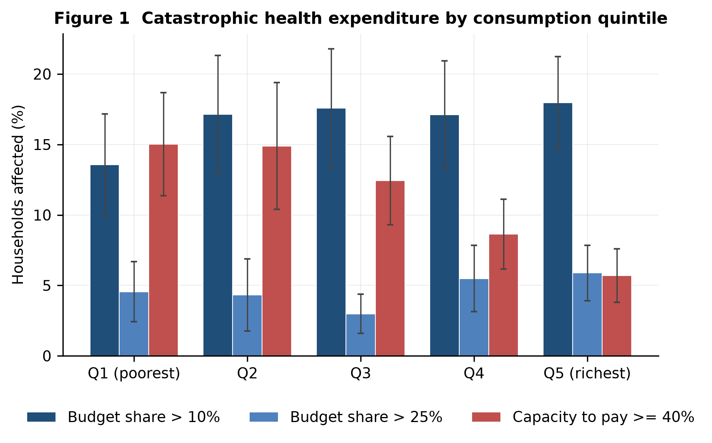
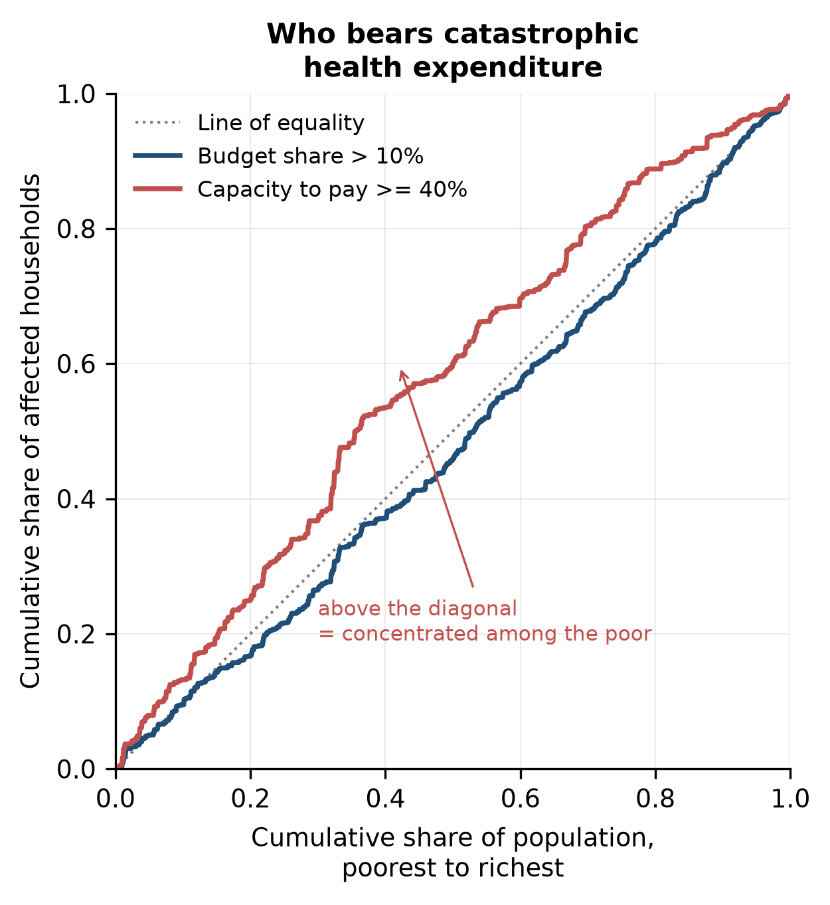
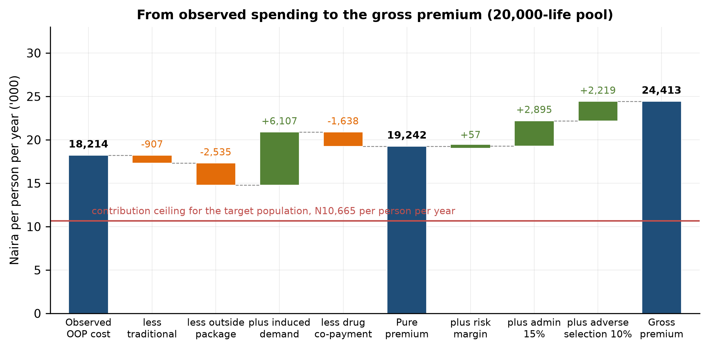
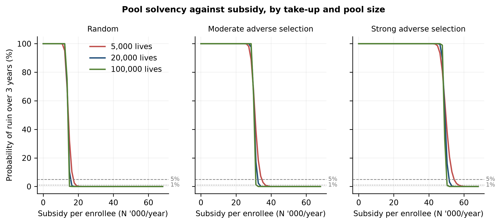
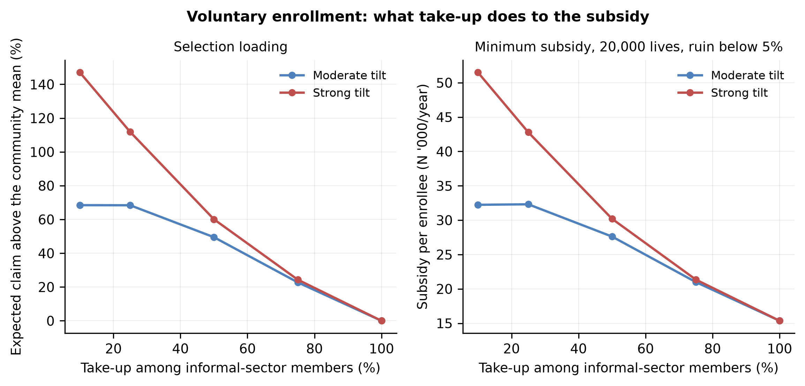
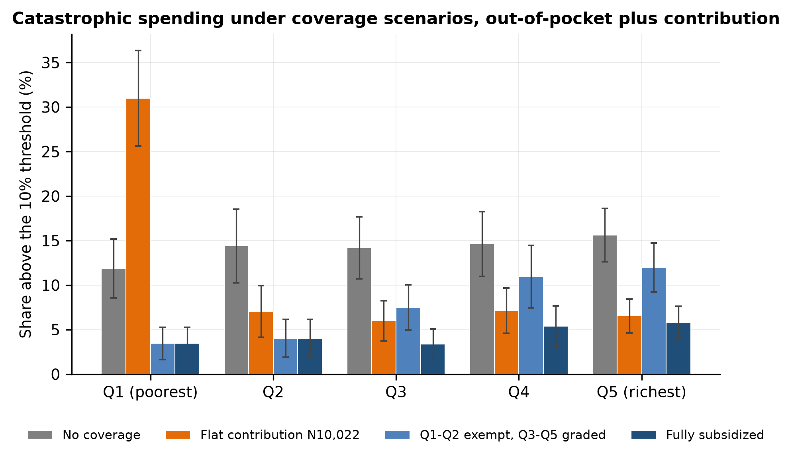

# Measuring the Health-Protection Gap and Actuarially Pricing Informal-Sector Health Insurance under Nigeria's NHIA Act 2022

**Oluwatosin Dorcas Babalola**¹ *(corresponding author)*, **Oluwakemi Elizabeth Iroko**², **Oluwakemi Oyinlade**¹

¹ Department of Actuarial Science, University of Lagos, Lagos, Nigeria. obabalola4@student.gsu.edu

² Department of Chemistry, University of Jos, Jos, Nigeria.

**Word count.** 5,457 excluding abstract, tables and references.

---

## Abstract

**Background.** Nigeria's National Health Insurance Authority Act 2022 mandates health insurance and creates a Vulnerable Group Fund, but informal-sector workers remain almost entirely uncovered. No study has priced the statutory package, tested the solvency of a pool providing it, and measured the protection it would buy.

**Methods.** Using the General Household Survey-Panel 2023/24 (4,685 households, 24,629 individuals), we estimated catastrophic health expenditure (CHE) on a consumption aggregate calibrated to published wave-4 data, with bounds for the annualized outpatient recall. We priced the NHIA basic package from individual cost models with induced demand and simulated pool ruin under alternative take-up, contribution schedules and reinsurance, with design-based bootstrap intervals.

**Results.** Insurance covers 1.07% of individuals. CHE at the 10% budget-share threshold affects 14.1% of the population (6.7% to 14.1% across recall bounds; 16.7% uncalibrated) and 7.9% on capacity to pay, the only measure concentrated among the poor. The gross premium is ₦27,247 per person-year (95% interval ₦24,270 to ₦30,388) against a contribution ceiling of ₦10,022. A 20,000-life pool needs a subsidy of ₦15,339 per enrollee under random take-up and ₦51,401 under strong adverse selection at low take-up. Graded contributions halve the subsidy; reinsurance does not reduce it. Fully subsidized coverage cuts CHE to 4.4%; a flat contribution leaves it at 11.5%.

**Conclusions.** The statutory package costs 2.7 times what intended beneficiaries can pay. The gap is expected cost, not volatility: enrollment mechanism, contribution design and the size of the Vulnerable Group Fund decide whether coverage protects poor households.

**Keywords.** catastrophic health expenditure; informal sector; health insurance pricing; Tweedie model; ruin probability; universal health coverage; Nigeria

---

## 1. Introduction

Out-of-pocket payments financed 71.9% of Nigeria's current health expenditure in 2023, among the highest shares recorded anywhere (WHO Global Health Expenditure Database). The National Health Insurance Authority (NHIA) Act 2022 was meant to change this: it makes health insurance mandatory, requires every state to run a scheme, obliges employers with five or more staff to enroll their workers, and creates a Vulnerable Group Fund to pay for those who cannot pay for themselves (Federal Republic of Nigeria 2022). Enrollment remains low, at about 22 million people or under a tenth of the population, and most Nigerian workers are informally employed. In the 2023/24 survey year analyzed here, 1.07% of individuals held health insurance.

A substantial Nigerian literature measures catastrophic health expenditure (Aregbeshola and Khan 2018; Edeh 2022; Opeloyeru and Lawanson 2023), and a commentary literature assesses the Act (Ipinnimo et al. 2022; Ahmad and Lucero-Prisno 2022). Neither tells a state scheme what the statutory package costs per enrollee, how much of that cost informal workers can carry, how large a subsidy keeps a voluntary pool solvent, or how much financial protection the package would deliver once the newly insured use more care. Those are actuarial questions, and this paper answers them on one nationally representative dataset.

The paper makes three contributions. First, it measures the protection gap under both the budget-share and the capacity-to-pay definitions, with an explicit treatment of the two measurement choices that dominate Nigerian estimates: the annualization of a four-week recall window and the construction of the consumption denominator. Second, it builds a transparent actuarial premium for the NHIA basic package from individual cost models, with design-based bootstrap intervals. Third, it embeds the cost distribution in a collective-risk model and asks what subsidy, take-up rate, contribution schedule and reinsurance arrangement a state pool needs to stay solvent, then recomputes catastrophic expenditure under each financing design. The central finding is that the gap between the actuarial price and what informal households can pay is an expected-value gap, not a volatility gap: it cannot be pooled, reinsured or diversified away, and it is multiplied by voluntary enrollment.

## 2. Background

### 2.1 The NHIA Act 2022

The Act replaced the National Health Insurance Scheme with an Authority and changed four things that matter here. Coverage became mandatory in law. Each state became the operative risk-bearing unit through a State Health Insurance Scheme. Employers with five or more staff were obliged to enroll their workers, a threshold we use to define formal employment. And the Vulnerable Group Fund, financed in part from the Basic Health Care Provision Fund, was created to subsidize those who cannot contribute. Ipinnimo et al. (2022) review the Act's provisions and list low government funding, workforce shortages and enforcement of the mandate as its main implementation risks; Ahmad and Lucero-Prisno (2022) call for an explicit definition of the vulnerable group and sustainable funding for the Authority. Neither attaches a number to the subsidy the Act's design requires. Several states have announced informal-sector contribution rates; Lagos State's Ilera Eko plan charges ₦15,000 a year for an individual and ₦55,000 for a family of four (July 2024). These rates are set administratively rather than actuarially, and we compare them with the modeled premium. A survey of insurance firms in Lagos, on which the present author worked, assessed social insurance as a strategy for extending social protection in Nigeria (Shogunro et al. 2023).

### 2.2 Measuring catastrophic expenditure

Two traditions coexist. The budget-share approach flags a household when health spending exceeds a fixed share of total consumption; it underlies SDG indicator 3.8.2 at the 10% and 25% thresholds and the global monitoring of Wagstaff et al. (2018) and WHO and World Bank (2023). The capacity-to-pay approach of Xu et al. (2003) compares health spending with consumption net of subsistence needs. Cylus et al. (2018) show for 14 European countries that the budget-share measure identifies richer households more often than poorer ones, while a normative-subsistence denominator concentrates catastrophic spending among the poor; Quintal (2019) makes the same point for Portugal and argues that distribution must be reported alongside incidence. Wagstaff and van Doorslaer (2003) introduced the overshoot measures used here, O'Donnell et al. (2008) codified their survey-based estimation, and Erreygers (2009) supplies the correction for binary outcomes. Shrime et al. (2015) show that catastrophic-expenditure estimates are sensitive to the definition adopted.

For Nigeria, Aregbeshola and Khan (2018) report an incidence of 16.4% at the 10% threshold for 2009/10, and Edeh (2022) reports a rise across three later survey rounds.

### 2.3 Informal workers, willingness to pay, and pricing

Extending coverage to informal workers is the binding problem for universal coverage in most low- and middle-income countries. Contributions cannot be collected through payroll and enrollment is voluntary in practice whatever the statute says, so who joins is decided by the household. Onasanya (2020) argues for demography-specific communication to raise informal-sector enrollment in Nigeria. Artignan and Bellanger (2021) review 16 studies of community-based health insurance in sub-Saharan Africa and find strong evidence that it raises outpatient use, weak evidence for inpatient use, and little evidence on equity. Jofre-Bonet and Kamara (2018) elicit willingness to pay among informal workers in Sierra Leone and find a mean of about USD 3.6 per adult per month, close to 5% of average monthly business income; they do not cost the package such a premium would fund. The 5% share is the same figure used as the affordability ceiling here.

Aggregate annual health cost per person has a point mass at zero and a long right tail, the structure the Tweedie compound Poisson-gamma family was built for (Smyth and Jørgensen 2002; Dunn and Smyth 2005). Klugman, Panjer and Willmot (2019) give the collective-risk and premium-principle framework, and Wüthrich (2015) links classical ruin probability to solvency capital. The demand response to insurance is the parameter that most affects a price: the RAND Health Insurance Experiment gives an arc elasticity near −0.2 (Manning et al. 1987), and Boes and Gerfin (2016) estimate about −0.14 from a Swiss policy change together with a rise in the probability of any cost.

## 3. Data

**Source and sample.** The Nigeria General Household Survey-Panel (GHS-Panel) is collected by the National Bureau of Statistics with the World Bank LSMS-ISA program. Wave 5 (2023/24) is the analysis file; wave 4 (2018/19), which carries a published consumption aggregate, is used for calibration and comparison. After dropping households without a cross-sectional weight, the file holds 4,685 households and 24,629 individuals in 511 enumeration areas across six strata; the weight grosses to 40.6 million households and 211 million people. Household characteristics are weighted by the household weight; catastrophic-expenditure rates weight households by household size, so they are the share of people living in an affected household, following the SDG 3.8.2 convention. Household-weighted rates are reported alongside.

**Out-of-pocket spending.** The health module asks every member whether they sought care in the past four weeks and what was paid for the consultation (explicitly excluding drugs), prescription drugs and non-prescription drugs, and separately about hospitalization and its cost over twelve months. The drug questions exclude drugs related to admissions and the hospitalization question includes them, so the two components do not overlap. Drugs are 86.25% of measured outpatient spending. Transport is excluded, following WHO practice, and tested as a variant. The non-food consumption module also asks a single twelve-month question about health spending; only 17% of households report any, implying a spending share of 0.3% of consumption against 4.9% in the published wave-4 aggregate, so it is not used.

**Annualization.** Outpatient spending observed in a four-week window is scaled by 13; inpatient spending is already annual. Scaling the window assumes the other twelve windows repeat the observed one, which maximizes the dispersion of annual spending across households and therefore the share crossing any threshold. The published wave-4 aggregate scales its own one-month health item by about twelve, so the convention is shared with the official statistics. Section 5.6 bounds its effect.

**Consumption.** Wave 5 publishes no consumption aggregate. One is rebuilt from the food module (seven-day recall, own production and gifts valued at local median unit values), three non-food modules and the education module, with health spending entering once from the health module. The same code run on wave 4 recovers 84% of the published aggregate, ranks households with a Spearman correlation of 0.80, and omits imputed rent. Holding out-of-pocket spending fixed, that shortfall raises CHE at the 10% threshold on wave 4 from 14.1% with the official aggregate to 17.6% with the rebuilt one. The main results therefore use a calibrated aggregate: each rebuilt component is scaled by the ratio of its official to its rebuilt wave-4 mean (1.158 for food, 0.892 for non-food) and imputed rent is added at the official rent-to-non-rent ratio (0.069). Imputed rent is 6.4% of calibrated wave-5 consumption. Applied to wave 4 itself the calibrated aggregate recovers 96% of the official level and gives CHE of 15.2% against 14.1% (Table A1). Uncalibrated results are reported throughout so the effect of the calibration is visible.

**Coverage and sector.** Section 5A asks whether any household member holds insurance, of what type, and which members are covered; the health type was identified by the fact that all ten households reporting a health-insurance premium in the consumption module report type 1. A worker is formal when the employer is a public body, state-owned enterprise, NGO or international organization, or a private firm with five or more staff; a household is informal if it contains no formal worker. On this rule 81.2% of households are informal (80.0% of the population). Three alternative rules are tested.

**Prices and poverty line.** All naira are constant August-2023 prices. The 2019 national poverty line of ₦137,430 per person per year (National Bureau of Statistics 2020) is carried forward with the composite CPI (factor 2.31) to ₦317,463.

## 4. Methods

### 4.1 Catastrophic expenditure and inequality

Under the budget-share definition a household is catastrophic if OOP/C exceeds 10%, 25% or 40% of total consumption C. Under the capacity-to-pay definition (Xu et al. 2003) household size is equivalized as size^0.56, subsistence spending per equivalent adult is the weighted mean food spending of households whose food share lies between the 45th and 55th percentiles, capacity to pay is consumption net of subsistence (or net of actual food spending where that is smaller), and the threshold is 40% of it. Intensity is the mean overshoot among affected households (Wagstaff and van Doorslaer 2003). Impoverishment compares poverty headcounts gross and net of out-of-pocket payments.

Inequality is summarized by the concentration index, CI = 2 cov(y, r)/mean(y), where r is the weighted fractional rank in per-capita consumption, with the Erreygers (2009) correction for binary outcomes and design-based standard errors from linearizing each index as a function of totals. All standard errors are Taylor-linearized for a stratified single-stage cluster design with enumeration areas as primary sampling units (Lumley 2004); domain estimates zero the weights outside the domain rather than dropping rows. Changes between scenarios are tested on the household-level difference, since the same households appear under both regimes.

### 4.2 Cost models

The unit is the individual-year and the models are survey-weighted with standard errors clustered on the enumeration area. Outpatient contact within the four-week window is modeled as a Poisson count with an offset of log(4/52), so fitted values are annual rates; inpatient episodes are modeled over twelve months without an offset. Cost per episode is modeled with gamma and lognormal GLMs. Annual cost per person is modeled with a Tweedie compound Poisson-gamma GLM with a log link, the variance power chosen by profile likelihood over 1.20 to 1.85; its fitted values are the predicted cost that drives the adverse-selection scenarios. Covariates are age band, sex, zone, urban residence, consumption quintile, severe functional difficulty from the Washington Group short set, and household size. Diagnostics are randomized quantile residuals (Dunn and Smyth 1996) and an observed-against-predicted lift table.

### 4.3 Benefit mapping and premium

The NHIA tariff schedule is not published in machine-readable form, so the package is defined by parameters, each a robustness lever. Traditional and spiritual care is excluded. Of the remainder, 85% of outpatient and 90% of inpatient spending is assumed to fall inside the package. Covered outpatient spending is split into drugs, which carry the NHIA's 10% co-payment, and services, which are free at the point of use. Induced demand uses the arc (midpoint) elasticity: with e = −0.20 and the patient's price falling from 1.0 to zero, use rises by a factor (1 + x)/(1 − x) with x = e(p1 − p0)/(p0 + p1), which is 1.50 for services and 1.39 for drugs. The insurer's expected cost per enrollee is the pure premium. A risk margin is added on the standard-deviation principle (0.10 σ/√n) or, alternatively, as a 95% CVaR margin on the simulated pool mean; an administrative load of 15% and an adverse-selection load of 10% then give the gross premium. Affordability is judged against 5% of per-capita consumption; the contribution ceiling for the target population is 5% of the mean per-capita consumption of informal-sector members of the bottom three quintiles.

### 4.4 Pool solvency and financing designs

A discrete-time collective-risk model tracks the surplus of a pool of n enrollees, U_t = U_(t−1) + n(C + s)(1 − e) − S_t, where C is the mean member contribution, s the subsidy per enrollee, e the expense ratio (10%), and S_t aggregate claims in year t, drawn by resampling annual insurer costs from the informal-sector population with survey weights (Klugman et al. 2019). Ruin is a negative surplus in any year of a one- or three-year horizon. The minimum subsidy holding the ruin probability below 5% or 1% is found by bisection on a fixed set of 10,000 simulated claim paths, so every financing scenario faces the same simulated experience. The empirical cost distribution is collapsed to its distinct values and each pool-year is drawn as one multinomial, which is exact and is checked against direct resampling (Table A12).

Adverse selection tilts enrollment odds by a factor of 1.5 or 2.0 per standard deviation of log predicted cost. Because a tilt is only possible when some people stay out, a take-up grid sets the enrollment probability to min(1, k × tilt) with k chosen so mean take-up equals 10%, 25%, 50%, 75% or 100%; at 100% take-up no selection is possible, which is the mandatory case. Three contribution schedules are compared: flat (the bottom-three-quintile ceiling for everyone), graded (each quintile's own ceiling) and exempt (Q1 and Q2 pay nothing, Q3 to Q5 graded). Per-life excess-of-loss reinsurance at retentions of ₦250,000, ₦500,000 and ₦1 million is priced at 1.3 times the expected ceded cost. A permanent 25% rise in claims from year 2 is the stress scenario.

### 4.5 Coverage counterfactual

Covered individuals pay the drug co-payment plus anything outside the package on the higher utilization induced demand implies; uncovered individuals keep their observed spending. Non-health consumption is held fixed and any contribution is a new call on the same budget. Catastrophic expenditure is recomputed on two bases: out-of-pocket payments alone (the SDG convention) and out-of-pocket payments plus the contribution. The exercise is an accounting simulation, not a causal estimate.

### 4.6 Recall bounds and bootstrap

The annualization is bounded by two extremes. The upper case scales each person's observed window to a year (full within-year persistence). The lower case draws each person's annual outpatient cost as a sum of N independent four-week windows, N ~ Poisson(13 × p̂), where p̂ is the fitted contact probability, with episode costs resampled from observed episodes in the person's quintile; 20 replicates are averaged. Both are carried through CHE, the premium and the subsidy, with the ×12 and ×10 multipliers alongside. A Rao-Wu rescaled bootstrap over enumeration areas within strata (200 replicates) gives percentile intervals for the premium, the expected claim and the minimum subsidy, quantities for which no linearized standard error exists.

## 5. Results

### 5.1 Sample, coverage and catastrophic expenditure

Mean household size is 5.2, mean annual consumption on the calibrated aggregate ₦1.99 million, and out-of-pocket health payments average 4.9% of consumption (Table 1). Informal-sector households are poorer (per-capita consumption ₦524,747 against ₦609,625, p = 0.008), more rural (34.3% against 60.1% urban) and more often female-headed (22.7% against 11.4%). Health insurance reaches 1.98% of households and 1.07% of individuals; coverage is 8.03% among formal-sector households against 0.57% among informal-sector households, and 0.20% of households paid a premium themselves (Table A2). The premise that the informal sector is the uncovered sector is observed, not assumed.

Catastrophic expenditure affects 14.1% of the population at the 10% threshold (95% CI 12.5 to 15.8), 3.4% at 25% and 0.8% at 40%; 7.9% (6.7 to 9.1) exceed 40% of capacity to pay (Table 2, Figure 1). The household-weighted rate at the 10% threshold is 14.8%. On the uncalibrated aggregate the same figures are 16.7% and 11.3%; the calibration lowers both because it raises the denominator. Affected households do not cross the line narrowly: the mean overshoot is 10.2 points at the 10% threshold and 15.1 points on capacity to pay. Out-of-pocket payments raise the poverty headcount from 57.2% to 60.3%, an impoverishing effect of 3.1 points that is stable across poverty lines from half to one and a half times the national line while the headcount itself is not (Table A3).

**Figure 1.** Catastrophic health expenditure by consumption quintile at the 10% and 25% budget-share thresholds and the 40% capacity-to-pay threshold. Bars are survey-weighted incidence; whiskers are 95% design-based confidence intervals.

### 5.2 The two definitions disagree about who is affected

The concentration index for budget-share CHE at 10% is +0.040 (95% CI −0.018 to +0.098), not distinguishable from zero; for capacity-to-pay CHE it is −0.150 (−0.223 to −0.077), pro-poor (Table 3, Figure 2). The same pattern appears by sector: on the budget-share measure informal and formal households are equally affected (14.4% against 13.3%, p = 0.59), while on capacity to pay informal households are affected at 8.7% against 4.8% (p = 0.005). Most of that gap is composition. In a population-weighted linear probability model the informal coefficient on capacity-to-pay CHE falls from 3.8 points unadjusted to 3.1 points (p = 0.03) with quintile controls and to 2.4 points (p = 0.11) with quintile, zone, residence and household-size controls; on budget share it is 1.3 points (p = 0.49) with the same controls (Table 3). Informal households are more exposed because they are poorer and more rural, not detectably because of informality itself. The mechanism is arithmetic. Richer households consume more and buy more care, so the ratio to total consumption does not sort by hardship; net of subsistence, the same naira registers as a much larger shock for a poor household. A linear decomposition (Table A4) attributes most of the budget-share index to hospitalization and household size, but the index is too close to zero for shares to be meaningful, and for the capacity-to-pay index the residual dominates, so the decomposition is reported for completeness only.

**Figure 2.** Concentration curves for the two definitions. A curve above the diagonal indicates a burden concentrated among the poor.

### 5.3 Cost models

Individuals average 2.75 outpatient contacts and 0.030 inpatient episodes a year, at mean costs of ₦6,977 per outpatient episode and ₦43,985 per inpatient episode, giving a mean annual cost of ₦19,675 with 78% of individuals recording no cost. The contact model is underdispersed (Pearson dispersion 0.78), as expected when a binary indicator is modeled as a count, so the negative binomial adds nothing. The lognormal fits episode cost better than the gamma (AIC 95,299 against 98,131). The profile likelihood selects a Tweedie variance power of p = 1.65 (Tables A6 and A7). Calibration by decile of prediction is close, with observed-to-predicted ratios between 0.81 and 1.13 and a top-decile mean of ₦83,195 against a bottom-decile mean of ₦3,104. Randomized quantile residuals have mean 0.07, standard deviation 1.00 and skew −0.11; the normality test rejects at n = 24,629, as it will for any parametric model. Risk relativities are large (Table A5): people aged 60 or over cost 3.31 times the community mean and those with a severe functional difficulty 6.44 times; cost rises from 0.26 of the mean in the poorest quintile to 2.57 in the richest, a demand effect that also means observed spending understates the health needs of the poor.

### 5.4 The premium and what people can pay

Observed cost of ₦19,675 per person-year falls to ₦16,487 once traditional care and services outside the package are removed; induced demand adds ₦6,808 and the drug co-payment returns ₦1,837, leaving a pure premium of ₦21,459 (Table 4, Figure 3). Loadings take a 20,000-life pool to a gross premium of ₦27,247 on the standard-deviation margin and ₦29,437 on the CVaR margin. The risk margin is ₦81 and falls to ₦36 at 100,000 lives; administration and the selection load, not claims volatility, separate the gross from the pure premium. The bootstrap interval for the gross premium is ₦24,270 to ₦30,388 (Table 8).

**Figure 3.** From observed spending to the gross premium for a 20,000-life pool. The horizontal line is the contribution ceiling for informal-sector members of the bottom three quintiles.

Measured against per-capita consumption the gross premium is 22.8% in the poorest quintile, 13.4% in Q2, 9.7% in Q3, 6.6% in Q4 and 3.0% in Q5, above the 5% ceiling in four quintiles out of five (Table 4). Billed per household it is ₦222,993 a year for an average household in Q1, which has 8.2 members. The contribution ceiling for informal-sector members of the bottom three quintiles is ₦10,022 per person-year, 37% of the gross premium. The modeled premium is 1.8 times Lagos State's individual Ilera Eko rate and half its family-of-four rate, a comparison that is a plausibility check rather than a like-for-like test because the packages differ and the published rates are nominal 2024 naira.

### 5.5 Solvency, take-up and financing design

At the flat contribution of ₦10,022, a 20,000-life pool with no opening capital needs a subsidy of ₦15,339 per enrollee to hold its three-year ruin probability below 5% under random take-up, ₦16,019 for a 1% target, and ₦51,401 under strong adverse selection (Table 5, Figure 4). Most of the subsidy is expected value: the expected claim of ₦21,342 divided by (1 − e) less the contribution gives ₦13,691, so process risk adds about ₦1,600 at this scale. Moving from a 5% to a 1% ruin target costs ₦680 per enrollee; moving from 5,000 to 100,000 lives lowers the subsidy under random take-up by 16%; moving from random to strong adverse selection raises it by a factor of 3.4. Opening capital equal to a quarter of a year's income at the gross premium lowers the random-take-up subsidy to ₦11,161, and a permanent 25% rise in claims from year 2 raises it to ₦18,723 (Table A8).

**Figure 4.** Probability of ruin over three years against subsidy per enrollee, by pool size and take-up pattern.

The take-up grid shows why enrollment mechanism matters more than pool size (Table 5, Figure 5). With a strong tilt the selection loading on expected claims is 147% at 10% take-up, 60% at 50%, 24% at 75% and zero at 100%; the corresponding subsidy falls from ₦51,486 to ₦21,351 at 75% take-up and ₦15,358 at full take-up. The moderate tilt converges to the same path above 50% take-up, because at high take-up almost everyone is enrolled whatever their predicted cost. The adverse-selection scenarios in the upper panel of Table 5 are therefore low-take-up scenarios, and the mandate in the Act, if enforced through group enrollment, is worth more to solvency than any plausible increase in pool size.

**Figure 5.** Voluntary enrollment: selection loading on the expected claim, and the subsidy needed for a 20,000-life pool, against the take-up rate among informal-sector members.

Contribution design changes the subsidy by more than reinsurance does (Table 6). A graded schedule in which each quintile pays its own 5% ceiling raises the mean contribution to ₦17,986 and lowers the subsidy under random take-up to ₦7,375; exempting the bottom two quintiles and grading the rest gives ₦14,529 and ₦10,831. Under strong selection the graded schedules collect more because the sick are disproportionately in the richer quintiles, and the subsidy falls from ₦51,401 to about ₦35,000 to ₦37,000. Per-life excess-of-loss reinsurance at a ₦250,000 retention cuts the standard deviation of pool claims per enrollee from ₦850 to ₦315, but the loaded reinsurance premium of ₦8,260 exceeds the process-risk saving and the required subsidy rises to ₦16,399; at higher retentions the effect is smaller in both directions. Reinsurance protects a pool against volatility, and volatility is not this pool's problem.

### 5.6 How much protection coverage buys

Measured on out-of-pocket payments alone, full coverage of the informal sector cuts CHE at the 10% threshold from 14.1% to 4.2% and capacity-to-pay CHE from 7.9% to 1.5% (Table 7). Measured on what households actually pay, the same coverage financed by the flat contribution cuts CHE only to 11.5% (a reduction of 2.6 points, p < 0.001), and capacity-to-pay CHE is unchanged at 8.4% (p = 0.47): the contribution removes from poor households roughly what the coverage gives them, every year rather than only in years of illness. By quintile, the flat contribution raises CHE in the poorest quintile from 11.9% to 31.0% while lowering it elsewhere (Figure 6, Tables A9 and A10). Fully subsidized coverage cuts CHE to 4.4% (a reduction of 9.7 points) and capacity-to-pay CHE to 1.7%. Exempting the bottom two quintiles and grading the rest reaches 7.6% and 2.5%, and subsidizing only the vulnerable group reaches 10.4% and 4.5%. On the out-of-pocket-only basis the contributory scheme scores marginally better than the fully subsidized one (4.2% against 4.4%) because the contribution enlarges the consumption denominator; that is a property of the SDG indicator, and it is why both bases are reported.

**Figure 6.** Catastrophic spending at the 10% threshold under coverage scenarios, by consumption quintile, on out-of-pocket payments plus the member contribution.

### 5.7 Bounds, intervals and robustness

The recall treatment is the largest single uncertainty (Table 8). With independent four-week windows in place of full persistence, CHE at the 10% threshold falls from 14.1% to 6.7% and capacity-to-pay CHE from 7.9% to 3.3%, because a household's annual spending is then the sum of many small pieces rather than thirteen copies of one. The premium barely moves (₦27,612 against ₦27,247), since it is a mean, and the random-take-up subsidy falls by about ₦1,500 through lower process risk and a slightly lower expected claim. Multipliers of 12 and 10 lower CHE to 13.3% and 11.2% and the gross premium to ₦25,324 and ₦21,478. The truth lies between the persistence bounds; chronic conditions make some persistence certain.

The bootstrap gives a standard error of 0.9 points on CHE at the 10% threshold, matching the linearized 0.8, and intervals of ₦24,270 to ₦30,388 for the gross premium, ₦12,050 to ₦18,948 for the random-take-up subsidy and ₦41,076 to ₦62,337 under strong selection. The 95% interval for the random-take-up subsidy is about a fifth as wide as the gap between random take-up and strong selection.

Across the 26 rows of the robustness grid (Table A11), equivalence-scale exponents from 0.5 to 1.0 move capacity-to-pay CHE by under 0.2 points; alternative informality rules change the subsidy by under 5%; fixing the Tweedie power at 1.4, 1.5 or 1.7 changes nothing material; including transport raises CHE to 15.3% and the premium by 7%; trimming the top 1% of costs lowers the premium by 20% and the subsidy by 40%, which is why the tail is kept. Benefit-design parameters behave monotonically: the elasticity range −0.10 to −0.35 spans gross premiums of ₦22,874 to ₦35,858. Wave 4 on its published aggregate gives 14.1% at the 10% threshold and 6.7% on capacity to pay (Table A12), against 14.1% and 7.9% for wave 5 on the calibrated aggregate. The waves differ in season (the wave-4 health module was fielded after harvest) and in the annualizer, so the comparison supports no trend in either direction; the rise that the uncalibrated wave-5 figures suggest comes from the denominator.

## 6. Discussion

**What the numbers say to a state scheme.** The pure premium for the basic package is about ₦21,500 per person-year in 2023/24 prices and the gross premium about ₦27,200, with a sampling interval of roughly ₦24,000 to ₦30,000. The most the target population can contribute is about ₦10,000. The difference is the subsidy, ₦15,300 per enrollee under random take-up and up to ₦51,400 under strong selection, or ₦1.5 to ₦5.1 billion a year per 100,000 enrollees. Nine tenths of that subsidy is the expected-value gap between the price of the package and the contribution, which no pooling, reinsurance or capital arrangement can remove. The operative policy question is the size and reliability of the Vulnerable Group Fund, not the contribution rate.

**Design.** Three design results follow. First, selection dominates scale: enrolling whole groups (cooperatives, market associations, transport unions, which the Act's recognition of Mutual Health Associations permits) at 75% take-up or better needs less than half the subsidy of individual voluntary enrollment at 10% take-up under a strong tilt. Second, a flat contribution undoes most of the protection it finances. Capacity-to-pay CHE does not fall when coverage is paid for by a uniform ₦10,022 contribution, and CHE in the poorest quintile rises from 12% to 31%. Contributions should be graded and the bottom two quintiles exempt; under random take-up that design lowers the subsidy by 29% relative to the flat schedule (a fully graded schedule lowers it by 52%) and delivers about two thirds of the reduction in CHE that full subsidy delivers. Third, reinsurance is the wrong instrument for this pool: its premium exceeds the volatility it removes.

**Measurement.** Our 14.1% at the 10% threshold sits with Aregbeshola and Khan's 16.4% for 2009/10 and our own 14.1% for wave 4. The level depends heavily on how it is measured. Within our own pipeline the annualization moves CHE between 6.7% and 14.1%, the denominator moves it between 14.1% and 16.7%, and the choice of instrument moves it between 0.1% and 16.7%. The level of catastrophic expenditure in Nigeria is dominated by measurement choices, and any subsidy calculation built on a single level inherits that. What is stable across our specifications is the ordering: the capacity-to-pay measure is pro-poor, and the budget-share measure shows no significant gradient in our data. Monitoring should report both definitions rather than rely on either alone.

**Limitations.** The counterfactual holds total consumption fixed, applies one elasticity from a US experiment, and assumes the package is delivered as specified; Boes and Gerfin's smaller elasticity would lower the premium, while their extensive-margin effect would raise it. The package parameters are assumptions until the NHIA publishes a tariff. Observed coverage (107 households) is too thin to identify the effect of coverage on spending, so coverage is assigned rather than estimated. The consumption aggregate is calibrated to wave 4 in the mean, so wave-5 levels, and the poverty headcount in particular, remain approximate. The selection scenarios are modeled tilts, not observed take-up. Households that forgo care appear as zero spenders, so every measure understates unmet need.

## 7. Conclusion

Catastrophic health expenditure affects between 7% and 14% of Nigerians at the 10% budget-share threshold depending on how a four-week recall window is treated, and between 3% and 8% on capacity to pay; only the capacity-to-pay measure locates the burden among poor households, and the higher rate among informal-sector households reflects their lower consumption. The NHIA basic package costs about ₦21,500 per person-year before loadings and ₦27,200 after, against a contribution ceiling of ₦10,000 for the households the Act intends to protect. Closing the gap is public expenditure, not insurance sold to informal workers: about ₦15,000 per enrollee under group enrollment and three times that under individual voluntary enrollment. Grading contributions and exempting the poorest two quintiles halves the subsidy and preserves most of the protection; a flat contribution preserves little of it.

---

## Declarations

**Data availability.** The GHS-Panel microdata are publicly available from the World Bank Microdata Library subject to registration and are not redistributed. All analysis code is available at https://github.com/tosin-babs/nigeria-health-protection-gap and will be archived with a Zenodo DOI on submission. An interactive calculator that reruns the pricing and solvency model in the browser is available at https://nigeria-health-protection-gap.vercel.app.

**Code availability.** Complete, seeded reproduction code in Python at the repository above; the README gives the script order and environment. The pipeline runs end to end from the raw survey files in about fifteen minutes.

**Competing interests.** None declared.

**Ethics.** The analysis uses de-identified secondary survey data and did not require ethical approval.

---

## References

1. Ahmad, D., & Lucero-Prisno III, D. E. (2022). The new National Health Insurance Act of Nigeria: how it will insure the poor and ensure universal health coverage. *Population Medicine*, 4(December), 1–2. doi:10.18332/popmed/157139
2. Aregbeshola, B. S., & Khan, S. M. (2018). Out-of-pocket payments, catastrophic health expenditure and poverty among households in Nigeria 2010. *International Journal of Health Policy and Management*, 7(9), 798–806. doi:10.15171/ijhpm.2018.19
3. Artignan, J., & Bellanger, M. (2021). Does community-based health insurance improve access to care in sub-Saharan Africa? A rapid review. *Health Policy and Planning*, 36(4), 572–584. doi:10.1093/heapol/czaa174
4. Boes, S., & Gerfin, M. (2016). Does full insurance increase the demand for health care? *Health Economics*, 25(11), 1483–1496. doi:10.1002/hec.3266
5. Cylus, J., Thomson, S., & Evetovits, T. (2018). Catastrophic health spending in Europe: equity and policy implications of different calculation methods. *Bulletin of the World Health Organization*, 96(9), 599–609. doi:10.2471/BLT.18.209031
6. Dunn, P. K., & Smyth, G. K. (1996). Randomized quantile residuals. *Journal of Computational and Graphical Statistics*, 5(3), 236–244. doi:10.1080/10618600.1996.10474708
7. Dunn, P. K., & Smyth, G. K. (2005). Series evaluation of Tweedie exponential dispersion model densities. *Statistics and Computing*, 15(4), 267–280. doi:10.1007/s11222-005-4070-y
8. Edeh, H. C. (2022). Exploring dynamics in catastrophic health care expenditure in Nigeria. *Health Economics Review*, 12(1), 22. doi:10.1186/s13561-022-00366-y
9. Erreygers, G. (2009). Correcting the concentration index. *Journal of Health Economics*, 28(2), 504–515. doi:10.1016/j.jhealeco.2008.02.003
10. Federal Republic of Nigeria (2022). *National Health Insurance Authority Act, 2022*. Abuja. Gazetted copy available at nhia.gov.ng.
11. Ipinnimo, T. M., Durowade, K. A., Afolayan, C. A., Ajayi, P. O., & Akande, T. M. (2022). The Nigeria National Health Insurance Authority Act and its implications towards achieving universal health coverage. *Nigerian Postgraduate Medical Journal*, 29(4), 281–287. doi:10.4103/npmj.npmj_216_22
12. Jofre-Bonet, M., & Kamara, J. (2018). Willingness to pay for health insurance in the informal sector of Sierra Leone. *PLOS ONE*, 13(5), e0189915. doi:10.1371/journal.pone.0189915
13. Klugman, S. A., Panjer, H. H., & Willmot, G. E. (2019). *Loss Models: From Data to Decisions* (5th ed.). Hoboken, NJ: Wiley.
14. Lumley, T. (2004). Analysis of complex survey samples. *Journal of Statistical Software*, 9(8). doi:10.18637/jss.v009.i08
15. Manning, W. G., Newhouse, J. P., Duan, N., Keeler, E. B., Leibowitz, A., & Marquis, M. S. (1987). Health insurance and the demand for medical care: evidence from a randomized experiment. *American Economic Review*, 77(3), 251–277.
16. National Bureau of Statistics (2020). *2019 Poverty and Inequality in Nigeria: Executive Summary*. Abuja: NBS.
17. O'Donnell, O., van Doorslaer, E., Wagstaff, A., & Lindelow, M. (2008). *Analyzing Health Equity Using Household Survey Data*. Washington, DC: World Bank.
18. Onasanya, A. A. (2020). Increasing health insurance enrolment in the informal economic sector. *Journal of Global Health*, 10(1), 010329. doi:10.7189/jogh.10.010329
19. Opeloyeru, O. S., & Lawanson, A. O. (2023). Determinants of catastrophic household health expenditure in Nigeria. *International Journal of Social Economics*, 50(6), 876–892. doi:10.1108/IJSE-02-2022-0132
20. Quintal, C. (2019). Evolution of catastrophic health expenditure in a high income country: incidence versus inequalities. *International Journal for Equity in Health*, 18(1), 145. doi:10.1186/s12939-019-1044-9
21. Shogunro, A., Olaniyan, S., Udobi-Owoloja, P. I., & Babalola, D. (2023). An assessment of social insurance as a strategy for enhancing social protection effectiveness in Nigeria. *Global Journal of Accounting*, 8(2), 1–15.
22. Shrime, M. G., Dare, A. J., Alkire, B. C., O'Neill, K., & Meara, J. G. (2015). Catastrophic expenditure to pay for surgery worldwide: a modelling study. *The Lancet Global Health*, 3(Suppl 2), S38–S44. doi:10.1016/S2214-109X(15)70085-9
23. Smyth, G. K., & Jørgensen, B. (2002). Fitting Tweedie's compound Poisson model to insurance claims data: dispersion modelling. *ASTIN Bulletin*, 32(1), 143–157. doi:10.2143/AST.32.1.1020
24. Wagstaff, A., & van Doorslaer, E. (2003). Catastrophe and impoverishment in paying for health care: with applications to Vietnam 1993–1998. *Health Economics*, 12(11), 921–933. doi:10.1002/hec.776
25. Wagstaff, A., Flores, G., Hsu, J., Smitz, M.-F., Chepynoga, K., Buisman, L. R., van Wilgenburg, K., & Eozenou, P. (2018). Progress on catastrophic health spending in 133 countries: a retrospective observational study. *The Lancet Global Health*, 6(2), e169–e179. doi:10.1016/S2214-109X(17)30429-1
26. WHO and World Bank (2023). *Tracking Universal Health Coverage: 2023 Global Monitoring Report*. Geneva: World Health Organization.
27. WHO Global Health Expenditure Database. Out-of-pocket expenditure as a share of current health expenditure, Nigeria, 2023 (World Bank indicator SH.XPD.OOPC.CH.ZS). Accessed September 2026.
28. Wüthrich, M. V. (2015). From ruin theory to solvency in non-life insurance. *Scandinavian Actuarial Journal*, 2015(6), 516–526. doi:10.1080/03461238.2013.858401
29. Xu, K., Evans, D. B., Kawabata, K., Zeramdini, R., Klavus, J., & Murray, C. J. L. (2003). Household catastrophic health expenditure: a multicountry analysis. *The Lancet*, 362(9378), 111–117. doi:10.1016/S0140-6736(03)13861-5
