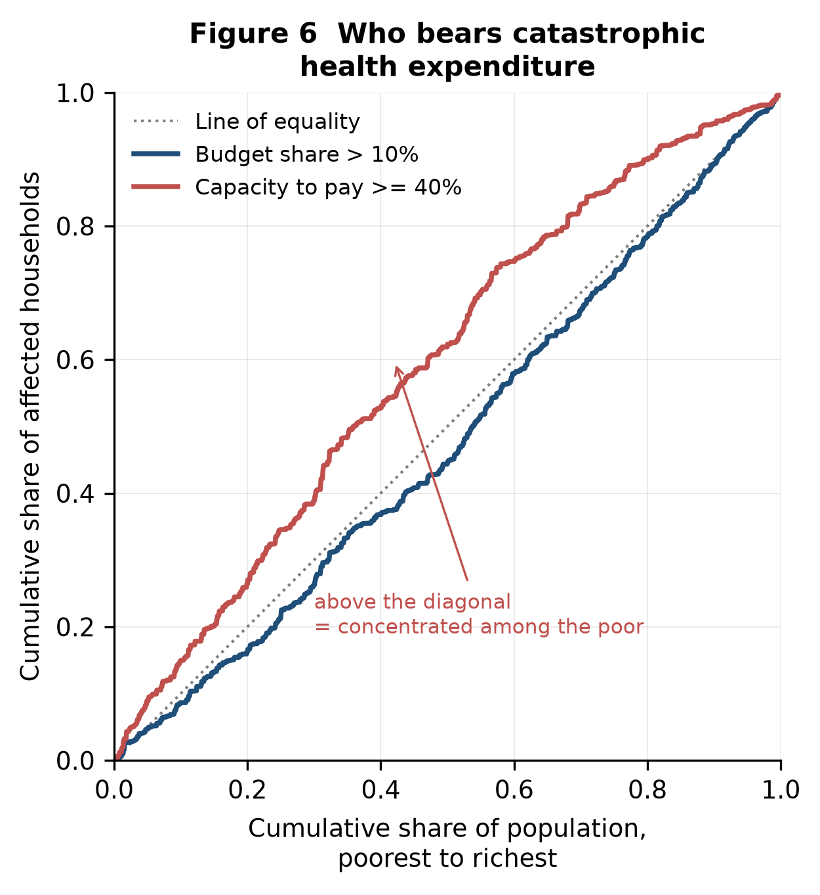
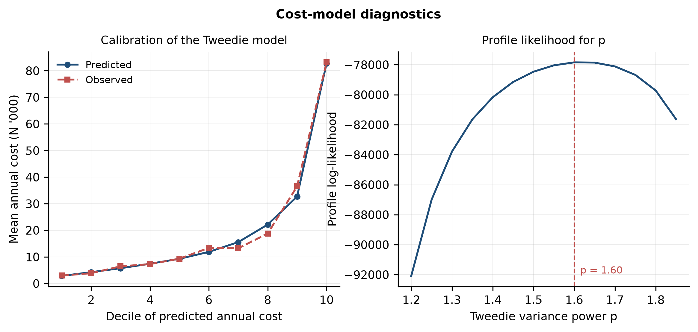
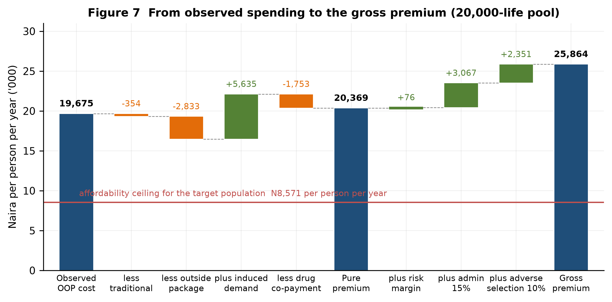
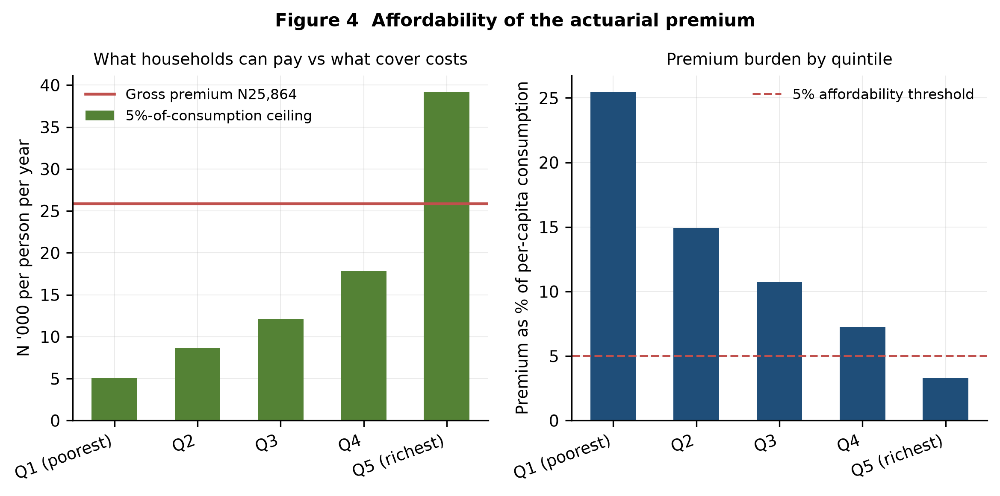
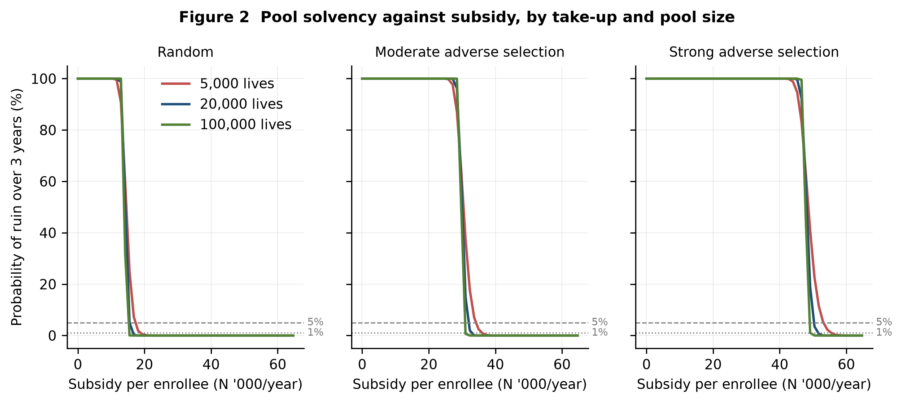
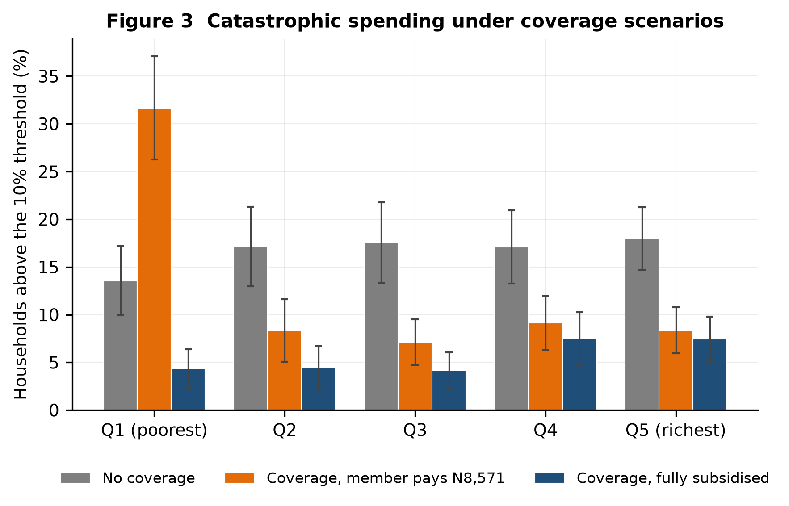

# Measuring the Health-Protection Gap and Actuarially Pricing Informal-Sector Health Insurance under Nigeria's NHIA Act 2022: A Frequency–Severity and Ruin-Probability Approach

**Oluwatosin Dorcas Babalola**¹ *(corresponding author)*

¹ Department of Actuarial Science and Quantitative Risk Analysis and Management, Georgia State University, Atlanta, GA, USA. obabalola4@student.gsu.edu

**Word count.** ~7,900 excluding abstract, tables and references. **Figures.** 7. **Tables.** 8 in text, 5 in appendix.

---

## Abstract

**Background.** Nigeria's National Health Insurance Authority Act 2022 makes health insurance mandatory and creates a Vulnerable Group Fund, but the informal sector — the large majority of Nigerian workers — remains almost entirely uncovered. Catastrophic health expenditure has been measured repeatedly in Nigeria. No study has combined that measurement with an actuarial price for the coverage the Act promises, a solvency test of the pool that would provide it, and a counterfactual for how much protection it would buy.

**Methods.** Using the nationally representative General Household Survey-Panel wave 5 (2023/24; 4,685 households, 24,629 individuals, grossing to 40.6 million households and 211.4 million people), we estimate catastrophic health expenditure at 10%, 25% and 40% budget-share thresholds and at the 40% capacity-to-pay threshold, with full survey design and Erreygers-corrected concentration indices. We fit Poisson frequency, gamma and lognormal severity, and Tweedie compound Poisson–gamma models of annual health-care cost, map them onto a basic benefit package with coinsurance and induced demand, and build a premium from pure to gross. A collective-risk simulation estimates the probability of ruin for a state-level informal pool under alternative take-up, adverse-selection and subsidy scenarios. A coverage counterfactual recomputes catastrophic expenditure under five financing designs.

**Results.** Health insurance reaches 1.98% of households and 1.07% of individuals; coverage is 8.03% among formal-sector households against 0.57% among informal-sector households. Catastrophic expenditure affects 16.7% of households at the 10% threshold (95% CI 14.9–18.4) and 11.3% at the 40% capacity-to-pay threshold (9.8–12.8); out-of-pocket payments push a further 2.5 percentage points below the national poverty line. The budget-share measure is distributionally uninformative (concentration index +0.045, ns) while the capacity-to-pay measure is sharply pro-poor (−0.185, 95% CI −0.248 to −0.121) and is the only one of the two that detects an informal-sector penalty (12.5% vs 6.6%, p<0.001). The actuarially fair premium for the basic package is ₦20,369 per person per year and the gross premium ₦25,864 — 25.5% of per-capita consumption in the poorest quintile, and above the 5% affordability ceiling in four quintiles out of five. Against a contribution the target population could actually pay (₦8,571), a 20,000-life pool needs a subsidy of ₦15,523 per enrollee (60% of the gross premium) to hold the three-year ruin probability below 5% under random take-up, rising to ₦50,210 (194%) under strong adverse selection. Fully subsidised coverage of the informal sector would cut catastrophic expenditure from 16.7% to 5.6%; the same coverage financed by a flat member contribution would cut it only to 12.9%, and would *raise* capacity-to-pay catastrophic expenditure to 14.6%.

**Conclusions.** Nigeria's protection gap is real but smaller than recent outlier estimates suggest, and it is concentrated where the capacity-to-pay measure looks rather than where the budget-share measure looks. Coverage cannot be sold to informal workers at a price they can pay, so the size of the Vulnerable Group Fund, not its existence, is the binding policy question. A flat community contribution is itself catastrophic for poor households and undoes most of the protection coverage is meant to deliver.

**Keywords.** catastrophic health expenditure; informal sector; health insurance pricing; Tweedie generalised linear model; ruin probability; universal health coverage; Nigeria

---

## 1. Introduction

Nigerians pay for health care mostly out of their own pockets, at the moment they are ill. Out-of-pocket payments finance roughly seven naira in every ten of current health expenditure — 71.9% in 2023, among the highest shares recorded anywhere. Because that spending is unpredictable and uninsured, an episode of illness is also a financial event, and for a substantial minority of households it is a ruinous one.

The National Health Insurance Authority Act 2022 was designed to change this. It makes health insurance mandatory, obliges every state to run a State Health Insurance Scheme, requires employers with five or more staff to enrol their workers, and creates a Vulnerable Group Fund to pay for those who cannot pay for themselves. Four years on, the Authority reports 22.03 million people enrolled as of July 2026 — under 10% of the population — and the gap is concentrated in the informal sector, which the National Bureau of Statistics puts at 93.0% of employment in the second quarter of 2024. Our own data put the position more starkly still: in the 2023/24 survey year, 1.07% of individuals held health cover, and formal-sector households were fourteen times as likely to be covered as informal-sector households.

An earlier assessment of Nigeria's social-insurance architecture, on which the present author worked, concluded that the country's social-protection instruments were failing to reach informal workers and identified health costs as the largest uncovered exposure (Sogunro et al.). This paper takes that qualitative finding and puts a price on it.

There is a substantial Nigerian literature measuring catastrophic health expenditure. Aregbeshola and Khan (2018) put incidence at 16.4% in 2009/10; Edeh (2022) traces its dynamics across survey rounds; Opeloyeru and Lawanson (2023) analyse its determinants; Aniebo, Lawani and Eze (2025) report 45.5% at the 10% threshold in post-pandemic data. A parallel commentary literature assesses the NHIA Act itself (Ipinnimo et al. 2022; Ahmad and Lucero-Prisno 2022). What none of this work does is take the next step. Measuring a gap does not tell a regulator what to charge, how large a pool must be to survive its own claims volatility, or how much of the gap coverage would actually close once the newly insured start using more care. Those are actuarial questions, and they are the questions a State Health Insurance Scheme has to answer before it can enrol anyone.

This paper answers them, and makes three contributions.

**First, a measurement contribution with a methodological edge.** We estimate catastrophic expenditure on nationally representative 2023/24 data with the full survey design, and we show that the choice between the budget-share and capacity-to-pay definitions is not a technicality: the two measures disagree about *who* is affected. The budget-share measure, which is the SDG 3.8.2 convention, produces a concentration index indistinguishable from zero — it identifies households that spend a lot on health, which are disproportionately households that can afford to. The capacity-to-pay measure, which nets out subsistence needs, is strongly pro-poor and is the only one of the two that detects the informal-sector penalty. Monitoring frameworks that rely on the budget-share measure alone will not see the population this Act is meant to protect.

**Second, an actuarial contribution.** We fit frequency, severity and Tweedie models to individual annual health-care cost and build a transparent premium from observed spending through benefit exclusions, induced demand and coinsurance to a loaded gross premium, and we test it against published state-scheme contributions. To our knowledge this is the first published actuarial price for the NHIA basic package for informal-sector individuals.

**Third, a solvency and counterfactual contribution.** We embed the fitted cost distribution in a collective-risk model and ask what a state pool would need — in contribution income, subsidy and opening capital — to keep its probability of ruin below 1% and 5% over one and three years, under random and adverse take-up. We then run coverage forward and recompute catastrophic expenditure, with induced demand included, so that the protection benefit is measured on the same footing as its cost.

The results reframe the policy problem. The binding constraint is not that Nigeria lacks a pricing methodology; it is that the actuarially fair price of the benefit package the Act promises is several times what its intended beneficiaries can pay, so the scheme is a public-finance question wearing an insurance costume. Quantifying that gap precisely — and showing what a flat community contribution does to the households it is supposed to protect — is what this paper adds.

The methods are deliberately general. Catastrophic-expenditure measurement, Tweedie cost modelling and ruin simulation are the same tools needed to study underinsured households in the United States, the individual-market risk pool, and Medicare's exposure to population ageing. This paper builds and validates that toolkit on a setting where the protection gap is largest.

## 2. Background and related literature

### 2.1 Health financing in Nigeria and the NHIA Act 2022

Nigeria's health system is financed predominantly by households. Public spending on health has remained a small share of government expenditure, well below the 15% Abuja commitment, and the resulting reliance on direct payments is the mechanism through which illness translates into impoverishment. The Basic Health Care Provision Fund, established under the National Health Act 2014, was the first substantial attempt to create a pooled, tax-financed stream for primary care.

The NHIA Act, signed in May 2022, replaced the National Health Insurance Scheme with an Authority and changed the legal architecture in four ways that matter here. Coverage became mandatory rather than voluntary. Every state was required to establish a State Health Insurance Scheme, making the state, not the federation, the operative risk-bearing unit. Employers with five or more staff were obliged to enrol their workers — a threshold we use directly in our definition of formal-sector employment. And the Act created the Vulnerable Group Fund, financed in part by the Basic Health Care Provision Fund and a health-insurance levy, to subsidise those who cannot contribute. The Act also recognises Mutual Health Associations and third-party administrators, which is the legal space an informal-sector pool would occupy.

Early commentary on the Act was broadly favourable about its architecture and sceptical about its financing. Ipinnimo et al. (2022) set the Act's provisions against the requirements for universal health coverage and identify the funding of the vulnerable-group provision as the principal unresolved question. Ahmad and Lucero-Prisno (2022) make a similar argument, noting that mandating coverage does not by itself create the fiscal space to deliver it. Adewole et al. (2021) show, using enrolee data from the predecessor scheme, that even among the insured, geographic access shapes whether coverage translates into use. None of these papers attaches a number to the subsidy the Act's own logic requires. The Act is explicit that some enrollees will be subsidised while remaining silent on how much subsidy, for how many people, and on what actuarial basis; that silence is what this paper fills.

Several states have launched schemes with published contribution rates for informal-sector members; Lagos State's LASHMA "Ilera Eko" plan is the most visible, at ₦15,000 a year for an individual and ₦55,000 for a family of four as announced in July 2024. These rates are set administratively rather than actuarially, and comparing them with a modelled premium is one of the external validity checks we report.

### 2.2 Measuring catastrophic health expenditure

International measurement rests on two traditions. The budget-share approach flags a household when health spending exceeds a fixed share of total consumption; it underpins SDG indicator 3.8.2 at the 10% and 25% thresholds, and Wagstaff et al. (2018) use it to track 133 countries. The capacity-to-pay approach of Xu et al. (2003) instead compares health spending with consumption net of subsistence needs, on the reasoning that a household spending most of its budget on food has almost no capacity to absorb a medical bill.

The two are not interchangeable. Cylus et al. (2018) show that they give materially different pictures of who is affected in Europe, and that the choice of denominator drives both the level and the distribution of measured hardship. Quintal (2019) makes the related point that incidence and inequality in catastrophic spending can move in opposite directions, so that a falling headcount can conceal a worsening distribution. Wagstaff and van Doorslaer (2003) introduced the overshoot measures that separate how many households cross a threshold from how far past it they go, and O'Donnell et al. (2008) codified the survey-based estimation of both. Erreygers (2009) supplies the correction required when the outcome is binary and its mean is far from one half, as it is here. Shrime et al. (2015) illustrate how sensitive cross-country comparisons are to these choices.

Our results extend the Cylus et al. finding to a low-income setting, in a stronger form: the two definitions in Nigeria do not merely differ in level, they disagree about the sign of the socioeconomic gradient.

### 2.3 Extending coverage to informal workers

The obstacle to universal coverage in most low- and middle-income countries is not the formal sector but everyone else. Onasanya (2020) frames the problem for the informal economy specifically: contributions cannot be collected through payroll, enrolment is voluntary in practice whatever the statute says, and voluntary enrolment selects. Community-based health insurance has been the most common institutional answer. Artignan and Bellanger's (2021) rapid review of sub-Saharan African schemes finds consistent evidence that community-based insurance increases utilisation among those who join, but persistently low enrolment and weak financial protection at the scheme level — a pattern consistent with small, adversely selected pools.

Willingness-to-pay studies map the affordability constraint directly. Jofre-Bonet and Kamara (2018) elicit willingness to pay for health insurance among informal workers in Sierra Leone and find it well below the actuarial cost of a meaningful benefit package. Our affordability analysis reaches the same conclusion for Nigeria by a different route: rather than eliciting stated willingness, we compare a modelled premium with observed consumption.

### 2.4 Pricing and solvency

The actuarial machinery this paper applies is standard, but it has rarely been brought to bear on informal-sector health insurance in a low-income country. Aggregate annual health cost per person has a large point mass at zero and a long right tail, which is exactly the structure the Tweedie compound Poisson–gamma family was designed for; Smyth and Jørgensen (2002) set out its use for insurance claims and Dunn and Smyth (2005) provide the density evaluation that makes profile likelihood for the variance power practical. Dunn and Smyth (1996) supply the randomised quantile residuals used here for diagnostics. Klugman, Panjer and Willmot (2019) give the collective-risk and premium-principle framework, and Wüthrich (2015) traces the modern connection between classical ruin theory and solvency capital that motivates our treatment of the required subsidy as a solvency requirement rather than a budgeting convenience.

The demand response to insurance is the parameter that most affects a price. The RAND Health Insurance Experiment (Manning et al. 1987) remains the reference randomised estimate, giving an arc elasticity near −0.2. Boes and Gerfin (2015) provide more recent quasi-experimental evidence that full insurance raises utilisation substantially at the lower end of the spending distribution, which is the part of the distribution that matters most for a basic package. We take −0.2 as the central case and test a range.

### 2.5 What is missing

Table A5 sets the closest studies side by side. Nigerian work measures the gap but stops short of pricing; the pricing and solvency literature is largely written for high-income markets or for microinsurance in the abstract; the willingness-to-pay literature establishes that informal workers cannot pay actuarial rates without quantifying the resulting subsidy or testing whether the pool that receives it survives. No published study we can find combines, on one nationally representative dataset, (a) catastrophic-expenditure measurement under both definitions, (b) an actuarial premium for a defined statutory package, (c) a ruin-probability test of the pool under adverse selection, and (d) a counterfactual that prices the protection actually bought. That combination is this paper's contribution.

For Nigeria specifically, published estimates at the 10% threshold span a wide range, from 16.4% for 2009/10 (Aregbeshola and Khan 2018) to 45.5% for 2023/24 (Aniebo et al. 2025). That spread is too large to be a real change over time, and is more plausibly explained by differences in the instrument used to measure out-of-pocket spending and in the consumption denominator. We return to this in the discussion, because our own estimate falls squarely in the lower part of the range and the reason matters for anyone using these numbers.

## 3. Data

**Source.** The analysis uses the Nigeria General Household Survey-Panel (GHS-Panel), collected by the National Bureau of Statistics with the World Bank's LSMS-ISA programme. Wave 5 (2023/24) is the main analysis file; wave 4 (2018/19) provides a trend comparison. We use the post-planting visit, which carries the health, labour, insurance and consumption modules, and the post-harvest education module.

**Sample and weights.** After dropping households without a cross-sectional weight, the analysis file contains 4,685 households and 24,629 individuals. Wave 5 releases three weights; we use `wt_cross_wave5`, the cross-sectional weight, which grosses up to 40.6 million households and 211.4 million people, matching Nigeria's population. The two panel weights gross to 27.0 and 29.7 million households respectively and would understate national totals by a third. Estimation treats enumeration areas as primary sampling units and the released six-level stratum variable as strata. Household characteristics are weighted by the household weight; population-level rates weight households by household size, following the WHO convention for SDG 3.8.2.

**Out-of-pocket spending.** Wave 5 offers two instruments and they do not agree. The non-food consumption module asks one household-level question about health spending over twelve months; only 17% of households report any, implying an out-of-pocket share of 0.3% of consumption. The health module asks every household member whether they sought care in the past four weeks, where, and what they paid — separating the consultation fee, which the questionnaire explicitly defines as excluding drugs, from prescription drugs, non-prescription drugs and transport — and asks separately about hospitalisation and its cost over twelve months. It yields an out-of-pocket share of 6.0%, consistent with the 5.4% recorded in wave 4's published consumption aggregate and with national health-accounts evidence. We therefore use the health module and report the consumption-module figure as a data-quality note (Table 8). The drug questions explicitly exclude drugs related to hospital admissions and the hospitalisation question explicitly includes them, so the outpatient and inpatient components do not overlap. Following WHO practice, out-of-pocket spending is defined as direct payments to providers and pharmacies and excludes transport; including transport is a robustness check. Insurance premiums are prepayment, not out-of-pocket spending, and are tracked separately.

Because the questionnaire separates the consultation fee from the two drug fields, the drug share of outpatient spending is measured rather than assumed: drugs are 86.25% of outpatient cost and the consultation fee 13.75%. This matters for pricing, because drugs carry the statutory co-payment and services do not.

**Health-insurance coverage.** Section 5A of the post-planting questionnaire asks directly whether any household member holds insurance, of what type, and which members are covered. The CSV release carries no codebook, so the health type was identified empirically: every one of the ten households that reported paying a health-insurance premium in the consumption module also reports insurance type 1, and no other type shows that correspondence. The build re-runs that check on every execution. Coverage and premium payment are distinct measures and differ by an order of magnitude, because employer-paid and subsidised cover involves no premium the household reports paying.

**Consumption.** Wave 5 publishes no consumption aggregate, so one is constructed from the food module (seven-day recall, with own production and gifts valued at the median unit value implied by other households' purchases of the same item in the same unit and size, taken from the finest geography with support), the three non-food modules (seven-day, thirty-day and twelve-month recalls, annualised), and the education module. Health spending enters the total once, from the health module.

Because the reconstruction involves judgement, we validate it. The identical code is run on wave 4, where the World Bank publishes an aggregate (`totcons_final.csv`), and the two are compared (Table A1). The reconstruction recovers 87% of the official level, with a Spearman rank correlation of 0.80 and 92% of households placed within one quintile of their official position. Consumption *levels* from wave 5 should therefore be treated as approximate; the ratios and rankings that catastrophic-expenditure measurement depends on are reliable. This matters most for the poverty headcount, which is a level, and least for the impoverishment *effect*, which is a difference — Table 8c shows the effect is stable across a wide grid of poverty lines while the headcount is not.

**Informal-sector definition.** A worker is classified formal when the employer is a public body, state-owned enterprise, NGO or international organisation, or a private firm with five or more staff — the threshold at which section 14 of the NHIA Act obliges enrolment. Everyone else in work is informal, and a household is informal if it contains no formal worker. On this rule 81.2% of households are informal (80.0% of the population). Three alternatives (public-sector employees only; any wage employee; the household head's status alone) are tested in Table 8.

**Limitations of the data.** Recall periods differ between outpatient and inpatient care, and annualising a four-week window by 13 assumes care-seeking is not bunched within the year; robustness tests damped multipliers of 10 and 6. Households that forgo care report zero out-of-pocket spending, so catastrophic-expenditure measures understate unmet need. Wave 5 fieldwork spans a period of very high inflation; all wave-4 comparisons are deflated to the wave-5 price base. Imputed housing rent is not in the reconstructed aggregate, which is part of why it sits below the official wave-4 level.

## 4. Methods

### 4.1 Notation

Let *h* index households and *i* individuals. OOP*ₕ* is annual out-of-pocket health spending, C*ₕ* total annual consumption, SE*ₕ* subsistence spending, and τ a catastrophic-expenditure threshold. For the cost models, *N* is the number of care episodes in a year, *X* the cost per episode, and *S* = *X*₁ + … + *X_N* the annual aggregate cost per person. π denotes a premium, π₀ = E[*S*] the pure premium, ψ(*u*) the probability of ruin from initial capital *u*, and *s* the subsidy per enrollee.

### 4.2 Catastrophic expenditure

Under the budget-share definition, CHE*ₕ*(τ) = 1 if OOP*ₕ*/C*ₕ* > τ, evaluated at τ = 10%, 25% and 40%. Under the capacity-to-pay definition (Xu et al. 2003), household size is equivalised as hhsize^0.56; subsistence spending per equivalent adult is the weighted mean food spending of households whose food share falls between the 45th and 55th percentiles; capacity to pay is C*ₕ* − SE*ₕ*, or C*ₕ* − food spending where that is smaller; and a household is catastrophic if OOP*ₕ* exceeds 40% of it.

Intensity is measured by the overshoot O*ₕ* = max(OOP*ₕ*/C*ₕ* − τ, 0), reported as a mean over all households and as a mean over affected households only (Wagstaff and van Doorslaer 2003). Impoverishment compares the poverty headcount using consumption gross and net of out-of-pocket payments, against the 2019 national line of ₦137,430 per person per year carried forward to the wave-5 price base (₦317,463), and is reported alongside the normalised poverty gap.

Inequality is summarised by the concentration index, computed from the convenient covariance identity CI = 2·cov*w*(*y*, *r*)/mean*w*(*y*) where *r* is the weighted fractional rank in per-capita consumption. For binary outcomes we report the Erreygers (2009) correction, E = 4·mean(*y*)·CI, which restores the [−1, 1] bounds the raw index loses when the mean is far from a half. Standard errors are design-based, obtained by linearising the index as a smooth function of totals. A linear Wagstaff-style decomposition attributes the index to observable characteristics; it is descriptive, not causal.

**Variance estimation.** All standard errors are Taylor-linearised for a stratified single-stage cluster design, with singleton strata centred on the grand mean. Domain estimates zero the weights outside the domain rather than dropping rows, so that the randomness in the number of sampled clusters within a domain is preserved. The implementation is in `python/svy.py` and reproduces the estimators in Lumley (2004).

### 4.3 Cost models

The unit is the individual-year. Three models are fitted, survey-weighted, with standard errors clustered on the enumeration area.

*Frequency.* The survey records whether a person had contact with a provider within a four-week window, not how many times. Modelling that indicator as a count with an offset of log(4/52) converts the fitted values into annual contact rates. Overdispersion is tested by regressing the squared Pearson residual on the fitted mean, and a negative binomial alternative is fitted. Inpatient episodes are modelled over a twelve-month window with no offset.

*Severity.* Cost per outpatient episode and per inpatient episode is modelled with gamma and lognormal GLMs with a log link, compared by AIC on a common scale. The inpatient severity model uses a leaner specification because the episode count is small.

*Aggregate cost.* Annual cost per person is modelled with a Tweedie compound Poisson–gamma GLM with a log link, which accommodates the point mass at zero and the right skew in a single model. The variance power *p* is chosen by profile likelihood over a grid from 1.20 to 1.85. Covariates throughout are age band, sex, zone, urban/rural, consumption quintile, an indicator of severe functional difficulty from the Washington Group short set, and household size.

Diagnostics are randomised quantile residuals (Dunn and Smyth 1996), which are standard normal under a correct model, and an observed-versus-predicted lift table by decile of prediction.

### 4.4 Benefit mapping and the premium

The NHIA tariff schedule is not public in machine-readable form, so the benefit package is defined transparently by parameters, each of which is a robustness knob. Traditional and spiritual care is excluded entirely. Of remaining spending, 85% of outpatient and 90% of inpatient costs are assumed to fall inside the basic package. Covered outpatient spending is split into drugs, which carry the NHIA's 10% co-payment, and services, which are free at the point of use; the split uses the measured 86.25% drug share described in Section 3.

Induced demand is applied with an arc (midpoint) elasticity, so the answer does not depend on which price is treated as the base. The point-of-service price falls from 1.0 (uninsured) to the coinsurance rate for drugs and to zero for services; at the RAND Health Insurance Experiment's central elasticity of −0.20 this raises drug utilisation by 32.7% and service utilisation by 40.0%. Elasticities of −0.10 and −0.35 are tested.

The insurer's expected cost per enrollee is the pure premium. Two risk-margin conventions are reported: the standard-deviation principle, θ·σ/√*n*, and a CVaR margin at the 95% level obtained by simulating the pool mean. Both shrink with pool size, which is the actuarial argument for scale. The gross premium adds an administrative load of 15% and an explicit adverse-selection load of 10%. Affordability is assessed against a ceiling of 5% of per-capita consumption.

### 4.5 Pool solvency

A discrete-time collective-risk model tracks the surplus of a pool of *n* enrollees:

> *U_t* = *U**t*−1 + *n*·(*C* + *s*)·(1 − *e*) − *S_t*

where *C* is the member contribution, *s* the subsidy per enrollee, *e* the expense ratio (10%), and *S_t* the pool's aggregate claims in year *t*. Ruin occurs if *U_t* < 0 at any *t* up to the horizon (one and three years). Aggregate claims are drawn by resampling individual annual insurer costs from the informal-sector population with survey weights.

Because the question the paper asks is what subsidy is needed given what people can pay, the member contribution is fixed at the affordability ceiling for informal households in the bottom three quintiles, and the subsidy is swept from zero to three times the gross premium. The minimum subsidy achieving a target ruin probability is found by bisection on a fixed set of simulated claim paths, so that every financing scenario faces the same simulated experience.

Take-up is modelled three ways: random, and adverse selection in which enrolment odds rise by a factor of 1.5 or 2.0 per standard deviation of predicted log cost. A one-off 25% medical-inflation shock is tested as a stress scenario. Ten thousand simulations are run per configuration with a fixed seed, and Monte Carlo standard errors are reported.

*Computational note.* Simulating a 100,000-life pool ten thousand times over three years is three billion individual draws if done naively. Instead the empirical cost distribution is collapsed to its distinct values and each pool-year is drawn as a single multinomial over that support. This is exact rather than approximate, and Table A4 confirms it against direct resampling (mean within 0.04%, 99th percentile within 0.5%).

### 4.6 Coverage counterfactual

Covered individuals pay the co-payment on covered drugs plus the full cost of anything outside the package, on the higher utilisation that induced demand implies; uncovered individuals keep their observed spending. Total consumption is held fixed except for the change in health payments: money no longer spent on care is spent on something else, and any member contribution is a new call on the same budget. Catastrophic expenditure is then recomputed.

Results are reported on two bases: out-of-pocket payments alone, which is the SDG 3.8.2 convention, and out-of-pocket payments plus the member contribution, which is what a household actually pays. The distinction turns out to matter more than any other modelling choice in the paper.

## 5. Results

### 5.1 Sample, coverage and the scale of out-of-pocket payment (RQ1)

Table 1 describes the weighted sample. Mean household size is 5.2, mean annual household consumption ₦1.73 million, and out-of-pocket health payments average 5.6% of consumption. Just over a fifth of individuals had contact with a provider in the four weeks before interview and 3.0% had been hospitalised in the preceding year. **81.2% of households contain no formal-sector worker** (80.0% of the population). Informal-sector households are poorer (per-capita consumption ₦451,633 vs ₦536,250, p<0.001), more rural (34.3% vs 60.1% urban, p<0.001), more likely to be female-headed (22.7% vs 11.4%, p<0.001) and more likely to contain someone with a severe functional difficulty (10.5% vs 6.7%, p<0.001).

**Health insurance reaches almost no one in this sample.** 1.98% of households (SE 0.34) contain any member with health cover, and 1.07% of individuals (SE 0.21) are themselves covered; only 0.20% of households paid a premium of their own. Coverage is 8.03% among formal-sector households against 0.57% among informal-sector households — a fourteen-fold gap — and rises monotonically across the consumption distribution, from 0.15% in the poorest quintile to 3.17% in the richest (Table 1b). Urban households are covered at 3.05% against 1.29% rural. The premise of this paper — that the informal sector is the uncovered sector — is therefore observed in the data rather than assumed.

**Catastrophic expenditure.** Table 2 reports incidence and intensity at every threshold, overall and by sector, quintile, zone and urban/rural; Figure 1 plots the quintile gradient. 16.7% of households (95% CI 14.9–18.4) spend more than 10% of consumption on health, 4.6% (3.6–5.7) more than 25%, and 1.1% (0.7–1.6) more than 40%. Under the capacity-to-pay definition, 11.3% (9.8–12.8) exceed the 40% threshold. Intensity is substantial: among affected households the mean overshoot is 11.2 percentage points at the 10% budget-share threshold and 20.3 percentage points at the capacity-to-pay threshold — households that cross the line do not cross it narrowly.

**Figure 1.** Catastrophic health expenditure by consumption quintile, at the 10% and 25% budget-share thresholds and the 40% capacity-to-pay threshold. Bars are survey-weighted incidence; whiskers are 95% design-based confidence intervals.

Out-of-pocket payments raise the poverty headcount from 66.2% to 68.7% (Table 2b), an impoverishment effect of **2.5 percentage points**, and widen the normalised poverty gap by 2.3 points. The headcount *levels* are higher than official poverty statistics, for the reasons set out in Section 3; Table 8c shows the impoverishment effect is stable across poverty lines from half to one and a half times the national line, so the finding does not depend on where the line is drawn.

### 5.2 The two definitions disagree about who is affected

This is the measurement result that matters most. Table 3 reports the concentration indices and Table 3b decomposes them. The concentration index for budget-share catastrophic expenditure at 10% is **+0.045 (95% CI −0.007 to +0.097)** — statistically indistinguishable from zero and, if anything, pro-rich. The concentration index for capacity-to-pay catastrophic expenditure is **−0.185 (95% CI −0.248 to −0.121)**, strongly and significantly pro-poor. The Erreygers-corrected values are +0.030 and −0.084 respectively. Figure 6 shows why the indices differ.

**Figure 2.** Concentration curves for the two catastrophic-expenditure definitions. A curve above the diagonal indicates a burden concentrated among the poor. The budget-share curve tracks the line of equality almost exactly; the capacity-to-pay curve bows clearly above it across the whole distribution.

The same divergence appears in the sector comparison (Table 2c). On the budget-share measure, informal-sector households are no more likely to face catastrophic spending than formal-sector households (16.7% vs 16.4%, p = 0.89). On the capacity-to-pay measure they are nearly twice as likely: **12.5% vs 6.6%, a gap of 6.0 percentage points (p < 0.001)**.

The reason is mechanical but consequential. The budget-share measure divides by total consumption, and rich households both consume more and buy more health care, so the ratio does not sort households by hardship. The capacity-to-pay measure divides by consumption net of subsistence, which is close to zero for poor households, so the same naira of medical spending registers as a much larger shock. Hypothesis H1 — that incidence would exceed 40% and be concentrated among the poor and informal — is therefore only half supported: incidence is well below 40%, and concentration among the poor and informal appears only under the capacity-to-pay definition.

### 5.3 Cost models (RQ2)

Individuals average 2.75 outpatient contacts and 0.030 inpatient episodes per year. Mean cost is ₦6,977 per outpatient episode and ₦43,985 per inpatient episode, giving a mean annual cost of **₦19,675 per person**, with 78% of individuals recording no cost at all.

Table 4 reports the three fitted models and Table 4b their fit statistics. The frequency model shows a Pearson dispersion of 0.775 — under- rather than overdispersion, which is expected when a binary contact indicator is modelled as a count, and means the negative binomial adds nothing. For severity, the lognormal fits better than the gamma (AIC 95,274 vs 98,072), consistent with the heavy right tail of Nigerian medical bills.

The profile likelihood (Table A2) selects a Tweedie variance power of **p = 1.60**, comfortably inside the compound Poisson–gamma range and toward the gamma end, again reflecting a skewed severity distribution. Calibration is good: across deciles of predicted cost the observed-to-predicted ratio stays between 0.85 and 1.13, and the model separates a bottom decile averaging ₦2,961 from a top decile averaging ₦83,153, a lift of 4.2 (Table A3). Randomised quantile residuals have mean 0.09, standard deviation 1.00 and skew −0.14; the formal normality test rejects, as it will at *n* = 24,629, but the shape is close to the model's prediction.

**Figure 3.** Cost-model diagnostics. Left: observed against predicted mean annual cost by decile of prediction. Right: profile log-likelihood for the Tweedie variance power, maximised at *p* = 1.60.

Risk relativities (Table 5e) are large. Relative to the community average, people aged 60 or over cost 3.31 times as much, and those with a severe functional difficulty 6.43 times. Costs rise steeply with consumption quintile (0.26 in Q1 to 2.60 in Q5) — a demand effect, not a morbidity effect, and a reminder that observed spending understates the health needs of the poor.

### 5.4 The premium, and what it costs relative to what people have

Table 5a and Figure 4 trace the build-up. Observed out-of-pocket cost of ₦19,675 per person-year falls to ₦19,320 once traditional and spiritual care is excluded and to ₦16,487 once services outside the basic package are removed. Induced demand then adds ₦5,635 — a **34.2% increase** — taking covered cost to ₦22,122, and the member's drug co-payment returns ₦1,753, leaving a **pure premium of ₦20,369**.

**Figure 4.** From observed spending to the gross premium, 20,000-member pool. Every stage of the build-up, including the raw observed spending the package is priced from, sits above what the target population can pay.

Loadings take the gross premium to **₦25,864 per person per year** for a 20,000-life pool on the standard-deviation risk margin (₦27,764 on the CVaR basis; Tables 5b and 5c). The risk margin itself is small and shrinks quickly with scale — ₦153 at 5,000 lives, ₦34 at 100,000 — because idiosyncratic claims risk diversifies away; administration and adverse selection, not volatility, are what make the gross premium exceed the pure premium.

Affordability is where the analysis turns (Table 5d, Figure 5). Measured against per-capita consumption, the gross premium is **25.5% in the poorest quintile**, 14.9% in Q2, 10.7% in Q3, 7.3% in Q4 and 3.3% in Q5. It exceeds the 5% affordability ceiling in four quintiles out of five. Hypothesis H2 — that the loaded premium would exceed 5% of consumption for the bottom two quintiles — is confirmed, and comfortably: the true reach of the problem is the bottom four. At the household level the premium for an average household in Q1 would be **₦210,396** a year. Two household sizes matter here and they answer different questions: the average household in the poorest quintile contains 8.1 people, while the average *person* in that quintile lives in a household of 10.0. Quintiles are ranked on per-capita consumption, so large households sort into the bottom of the distribution almost mechanically — which is itself part of why a per-person premium bears so heavily on them.

**Figure 5.** Affordability of the actuarial premium. Left: the 5%-of-consumption ceiling by quintile against the gross premium. Right: the premium as a share of per-capita consumption, against the 5% threshold.

The modelled premium of ₦25,864 is 1.7 times Lagos LASHMA's published individual informal-sector rate of ₦15,000 but 0.47 times its family-of-four rate of ₦55,000 (Table 5f). The comparison is a plausibility check rather than a like-for-like test: the Ilera Eko package is not the NHIA basic package priced here, and the published rates are nominal July-2024 naira against a premium in August-2023 naira. That an administratively set individual rate sits below the actuarial price of a statutory package, while the family rate sits above the per-person price times four, is what one would expect from a scheme cross-subsidising individuals from families.

### 5.5 Pool solvency (RQ3)

Five percent of per-capita consumption for informal households in the bottom three quintiles is **₦8,571 per person per year** (Table 6a). That is what the target population can pay. The gross premium is ₦25,864. The gap is the policy problem, and the subsidy has to close it.

Adverse selection makes it much worse. Tilting enrolment toward higher predicted cost raises expected claims per enrollee from ₦20,262 under random take-up to ₦34,296 under moderate selection (**+69%**) and ₦50,455 under strong selection (**+149%**).

Table 6b gives the full grid of ruin probabilities and Table 6c the minimum subsidy. For a 20,000-life pool over three years with no opening capital:

| Take-up | Subsidy for ψ < 5% | As % of gross premium | Subsidy for ψ < 1% |
|---|---:|---:|---:|
| Random | ₦15,523 | 60% | ₦16,144 |
| Moderate adverse selection | ₦31,748 | 123% | ₦32,724 |
| Strong adverse selection | ₦50,210 | 194% | ₦51,397 |

**Figure 6.** Probability of ruin over three years against subsidy per enrollee, by pool size and take-up pattern. Moving from random take-up to strong adverse selection shifts the curve far further right than any change in pool size.

Three features stand out. First, the subsidy required is large in every scenario: even with random take-up the state must find roughly ₦1.55 billion a year per 100,000 enrollees. Second, moving the ruin target from 5% to 1% costs very little — ₦621 per enrollee under random take-up — because the pool mean is tightly distributed once *n* is in the tens of thousands; capital and prudence are cheap, and adverse selection is expensive. Third, pool size helps but not enough: going from 5,000 to 100,000 lives cuts the required subsidy under random take-up by about 15%, while a shift from random to strong adverse selection roughly triples it. **The dominant solvency risk is who enrols, not how many.**

A one-off 25% medical-inflation shock (Table 6d) raises the required subsidy materially but by far less than selection does.

Hypothesis H3 is supported: without subsidy, a voluntary pool charging what its members can afford is insolvent with near-certainty, and the subsidy that restores solvency is quantifiable and large.

### 5.6 How much protection would coverage buy? (RQ4)

Table 7a reports every scenario on both payment bases, Table 7b the reductions and their significance, and Table 7c the results by quintile. The answer depends entirely on who pays the contribution.

Measured on out-of-pocket payments alone, coverage works as advertised. Full coverage of the informal sector cuts catastrophic expenditure at the 10% threshold from 16.7% to **5.4%** (a 67.8% reduction, p<0.001), and capacity-to-pay catastrophic expenditure from 11.3% to 2.2% (an 80.9% reduction).

Measured on total household health payments — out-of-pocket plus the ₦8,571 member contribution — the picture changes sharply. Full coverage of the informal sector cuts catastrophic expenditure only to **12.9%** (a 22.5% reduction), and capacity-to-pay catastrophic expenditure **rises**, from 11.3% to 14.6% (p = 0.02). A flat contribution that is affordable on average is catastrophic for the households at the bottom of the distribution, and it lands on them every year rather than only in years they fall ill.

**Figure 7.** Catastrophic spending at the 10% threshold under coverage scenarios, by consumption quintile. Coverage financed by a flat member contribution leaves the poorest households little better off than no coverage at all.

Full coverage financed entirely by subsidy is what delivers the protection: catastrophic expenditure falls to **5.6% at the 10% threshold (a 66.5% reduction, p<0.001)** and to 3.7% on the capacity-to-pay measure (a 67.4% reduction). Subsidising only the vulnerable group — the bottom two quintiles of informal households — achieves a 26.2% reduction at the 10% threshold and a 34.8% reduction on the capacity-to-pay measure, at a fraction of the cost.

Hypothesis H4 — that coverage reduces catastrophic expenditure substantially but by less than naive estimates once induced demand is included — is supported, and the mechanism is sharper than anticipated: induced demand costs some of the naive reduction, but the financing of the contribution costs far more.

### 5.7 Robustness

Table 8 reports 25 variants. The headline conclusions are stable under every change that is a genuine analytic choice, and move only under changes that alter what is being measured.

Equivalence-scale variants (0.5 to 1.0) move capacity-to-pay incidence by less than 0.3 percentage points. Alternative informal-sector definitions change the required subsidy by under 5%. Fixing the Tweedie variance power at 1.4, 1.5 or 1.7, refitting the model each time, changes nothing material. Including transport raises catastrophic-expenditure incidence from 16.7% to 17.8% and the gross premium by about 7%.

The annualiser matters, as expected: damping the four-week outpatient window from 13× to 10× lowers incidence from 16.7% to 13.1%, and 6× lowers it to 7.3%, with the gross premium falling in proportion. This is the single most consequential measurement assumption in the paper and it should be read as a genuine uncertainty band rather than a sensitivity footnote.

Trimming the top 1% of costs lowers the gross premium by about 20% and the required subsidy by about 37%. We keep the tail in the main results: for a pricing and solvency exercise, the tail *is* the risk.

Benefit-design parameters behave monotonically and sensibly. Widening outpatient coverage from 70% to 100% raises the gross premium by about 39%; raising the drug co-payment from 0% to 20% lowers it by about 15%; the elasticity range from −0.10 to −0.35 spans gross premiums of ₦22,477 to ₦31,041.

Wave 4 (2018/19) gives catastrophic expenditure of 14.2% at the 10% threshold, 2.5% at 25% and 6.7% on the capacity-to-pay measure, against 16.7%, 4.6% and 11.3% in wave 5 (Table 8b). The comparison suggests a real deterioration, most pronounced on the capacity-to-pay measure, which is what one would expect during a period when food prices rose faster than incomes. It should be read with care: the two waves use different instruments for out-of-pocket spending, and the wave-5 denominator is reconstructed.

## 6. Discussion

**What the numbers mean for the NHIA and state schemes.** Three figures are directly usable. The actuarially fair premium for the basic package is about **₦20,400 per person per year** and the gross premium about **₦25,900**, in 2023/24 prices, for a community-rated informal-sector pool. The affordability ceiling for the population the Vulnerable Group Fund is meant to reach is about **₦8,600**. The gap — roughly **₦15,500 to ₦16,100 per enrollee per year under random take-up, and two to three times that if enrolment is adversely selected** — is the subsidy a state scheme needs. For a state enrolling 100,000 informal-sector members, that is ₦1.55 to ₦5.14 billion a year.

These are large numbers, and they are the point. The NHIA Act's mandate is not self-financing for the population it most needs to reach. Debating contribution rates for informal workers is, on this evidence, largely beside the point; the operative question is the size and reliability of the Vulnerable Group Fund.

**Design implications.** Two findings bear directly on scheme design. First, the dominant solvency risk is selection, not scale. A state scheme that enrols voluntarily, one household at a time, will attract the sick; the same scheme enrolling whole groups — cooperatives, market associations, transport unions, which is precisely what the Act's recognition of Mutual Health Associations enables — faces a required subsidy roughly a third as large. Group enrolment is worth more to solvency than tripling the pool. This is the practical counterpart to Artignan and Bellanger's (2021) finding that community-based schemes raise utilisation among joiners without achieving population-level financial protection: small voluntary pools are selected pools.

Second, a flat community contribution undermines the protection it finances. Our counterfactual shows capacity-to-pay catastrophic expenditure *rising* when coverage is paid for by a uniform ₦8,571 contribution, because a flat payment is regressive against a distribution in which the poorest quintile's per-capita consumption is ₦101,550. If contributions are to be charged at all, they should be graduated, and the bottom two quintiles should be fully subsidised — which is close to what the Act's vulnerable-group provisions envisage, and our results quantify what that provision is worth: a 26% reduction in catastrophic expenditure at the 10% threshold and 35% on the capacity-to-pay measure.

**On measurement.** Our estimate of 16.7% at the 10% threshold is close to Aregbeshola and Khan's 16.4% for 2009/10 and well below the 45.5% reported by Aniebo et al. (2025) for post-pandemic data. We do not think the difference is a real change. Our own robustness table shows that the annualisation of a four-week recall window alone moves the estimate between 7.3% and 16.7%, and the choice of instrument for out-of-pocket spending moves it between 0.1% and 16.7%. Estimates of catastrophic expenditure in Nigeria are dominated by measurement choices, and papers reporting them should publish the full sensitivity rather than a single headline. This is not a minor methodological point: SDG 3.8.2 monitoring, and any subsidy calculation built on it, inherits that fragility.

The stronger and more portable finding is the divergence between definitions. A monitoring framework using the budget-share measure alone would conclude that informal-sector households in Nigeria face no more financial hardship from health care than formal-sector households. The capacity-to-pay measure shows they face nearly twice as much. Cylus et al. (2018) found the two measures diverge in Europe; in Nigeria they disagree about the sign of the gradient. Where a country's poor spend most of their budget on subsistence, the budget-share measure is close to uninformative about hardship, and both should be reported.

**Transferability, including to the United States.** The framework — measure the gap on capacity-to-pay as well as budget-share terms, fit a Tweedie cost model, price the benefit with induced demand, and test the pool's solvency under adverse selection — is not Nigeria-specific. It applies wherever coverage is being extended to workers outside standard employment: community-based schemes across sub-Saharan Africa, Indonesia's and the Philippines' informal-sector segments, and, in a different institutional dress, the United States. Roughly the same structural problem appears in the US individual market, where gig and self-employed workers buy coverage voluntarily, selection is the dominant pricing risk, and subsidy design determines both take-up and pool stability. The finding that a flat contribution can raise measured financial hardship among low-income enrollees has a direct analogue in debates over deductibles and premium contributions in subsidised US coverage. The measurement and modelling toolkit built here is the one applied to US data in the next paper of this programme.

**Limitations.** The counterfactual is an accounting simulation, not a causal estimate; it holds total consumption fixed, applies a single elasticity from a US experiment conducted four decades ago, and assumes the benefit package is delivered as specified. Boes and Gerfin (2015) suggest the response at the low end of the spending distribution may be larger than the RAND average, which would raise the premium. The benefit-package parameters are assumptions, not the NHIA's published schedule, and should be replaced when that schedule becomes available. Out-of-pocket spending is measured from a four-week window for outpatient care, and the annualiser is the paper's largest single uncertainty. The consumption denominator is reconstructed and recovers 87% of wave 4's published aggregate, so consumption levels — and therefore poverty headcounts — should be treated as approximate. Households that forgo care entirely appear as zero spenders, so all catastrophic-expenditure measures understate unmet need; the 149% claims uplift we find under strong adverse selection is a modelled scenario, not an observed take-up pattern. Finally, although wave 5 does measure who holds insurance, observed coverage is far too thin — 107 households in total — to identify the effect of coverage on spending, so the counterfactual assigns coverage rather than estimating its effect from those who have it.

## 7. Conclusion

Health insurance reaches 1.07% of Nigerians, and 0.57% of informal-sector households. Catastrophic health expenditure affects 16.7% of households at the 10% budget-share threshold and 11.3% at the 40% capacity-to-pay threshold, and out-of-pocket payments push a further 2.5 percentage points of the population below the national poverty line; the burden falls on poor and informal-sector households, but only the capacity-to-pay measure detects it. The actuarially fair premium for the NHIA basic package is ₦20,369 per person per year and the gross premium ₦25,864, against an affordability ceiling of ₦8,571 for the population the Act intends to protect. A state pool charging what its members can afford needs a subsidy of ₦15,523 per enrollee to hold its three-year ruin probability below 5% under random take-up, and ₦50,210 under strong adverse selection.

Closing Nigeria's health-protection gap is affordable only as public expenditure, not as insurance sold to informal workers; the policy choice is how large the Vulnerable Group Fund must be, and how enrolment is organised so that selection does not multiply its cost.

---

## Declarations

**Data availability.** The GHS-Panel microdata are publicly available from the World Bank Microdata Library subject to registration and are not redistributed. All analysis code is available at https://github.com/tosin-babs/nigeria-health-protection-gap and will be archived with a Zenodo DOI on submission. An interactive calculator that reruns the pricing and solvency model in the browser is available at https://nigeria-health-protection-gap.vercel.app.

**Code availability.** Complete, seeded reproduction code in Python at https://github.com/tosin-babs/nigeria-health-protection-gap; see the repository README for the script order and environment. The full pipeline runs end to end from the raw survey files in about eight minutes.

**Funding.** *[to be completed]*

**Competing interests.** None declared.

**Ethics.** The analysis uses de-identified secondary survey data and did not require ethical approval.

**AI-assistance disclosure.** Generative AI (Claude, Anthropic) was used to assist with code development, code review and language editing. The author designed the study, specified all models and parameters, verified and interpreted all results, and takes full responsibility for the content. AI systems are not authors and are not listed as such.

**CRediT statement.** **Oluwatosin Dorcas Babalola**: conceptualisation, methodology, software, formal analysis, data curation, writing — original draft, writing — review and editing.

---

## References

1. Adewole, D. A., Reid, S., Oni, T., & Adebowale, A. S. (2021). Geospatial distribution and bypassing health facilities among National Health Insurance Scheme enrollees: implications for universal health coverage in Nigeria. *International Health*, 14(3), 260–270. doi:10.1093/inthealth/ihab039
2. Ahmad, D., & Lucero-Prisno III, D. E. (2022). The new National Health Insurance Act of Nigeria: how it will insure the poor and ensure universal health coverage. *Population Medicine*, 4(December), 1–2. doi:10.18332/popmed/157139
3. Aniebo, C. L., Lawani, L. O., & Eze, P. (2025). The burden and socioeconomic inequality in catastrophic out-of-pocket health expenditure in post-pandemic Nigeria. *Global Social Welfare*, 13(2), 205–218. doi:10.1007/s40609-025-00423-4
4. Aregbeshola, B. S., & Khan, S. M. (2018). Out-of-pocket payments, catastrophic health expenditure and poverty among households in Nigeria 2010. *International Journal of Health Policy and Management*, 7(9), 798–806. doi:10.15171/ijhpm.2018.19
5. Artignan, J., & Bellanger, M. (2021). Does community-based health insurance improve access to care in sub-Saharan Africa? A rapid review. *Health Policy and Planning*, 36(4), 572–584. doi:10.1093/heapol/czaa174
6. Boes, S., & Gerfin, M. (2015). Does full insurance increase the demand for health care? *Health Economics*, 25(11), 1483–1496. doi:10.1002/hec.3266
7. Cylus, J., Thomson, S., & Evetovits, T. (2018). Catastrophic health spending in Europe: equity and policy implications of different calculation methods. *Bulletin of the World Health Organization*, 96(9), 599–609. doi:10.2471/BLT.18.209031
8. Dunn, P. K., & Smyth, G. K. (1996). Randomized quantile residuals. *Journal of Computational and Graphical Statistics*, 5(3), 236–244. doi:10.1080/10618600.1996.10474708
9. Dunn, P. K., & Smyth, G. K. (2005). Series evaluation of Tweedie exponential dispersion model densities. *Statistics and Computing*, 15, 267–280. doi:10.1007/s11222-005-4070-y
10. Edeh, H. C. (2022). Exploring dynamics in catastrophic health care expenditure in Nigeria. *Health Economics Review*, 12(1). doi:10.1186/s13561-022-00366-y
11. Erreygers, G. (2009). Correcting the concentration index. *Journal of Health Economics*, 28(2), 504–515. doi:10.1016/j.jhealeco.2008.02.003
12. Federal Republic of Nigeria (2022). *National Health Insurance Authority Act, 2022*. Available at nhia.gov.ng.
13. Ipinnimo, T. M., Durowade, K. A., Afolayan, C. A., Ajayi, P. O., et al. (2022). The Nigeria National Health Insurance Authority Act and its implications towards achieving universal health coverage. *Nigerian Postgraduate Medical Journal*, 29(4), 281–287. doi:10.4103/npmj.npmj_216_22
14. Jofre-Bonet, M., & Kamara, J. (2018). Willingness to pay for health insurance in the informal sector of Sierra Leone. *PLOS ONE*, 13(5), e0189915. doi:10.1371/journal.pone.0189915
15. Klugman, S. A., Panjer, H. H., & Willmot, G. E. (2019). *Loss Models: From Data to Decisions* (5th ed.). Wiley. ISBN 978-1-119-52378-9
16. Lumley, T. (2004). Analysis of complex survey samples. *Journal of Statistical Software*, 9(8). doi:10.18637/jss.v009.i08
17. Manning, W. G., Newhouse, J. P., Duan, N., Keeler, E. B., Leibowitz, A., & Marquis, M. S. (1987). Health insurance and the demand for medical care: evidence from a randomized experiment. *American Economic Review*, 77(3), 251–277.
18. O'Donnell, O., van Doorslaer, E., Wagstaff, A., & Lindelow, M. (2008). *Analyzing Health Equity Using Household Survey Data*. Washington, DC: World Bank. ISBN 978-0-8213-6933-3
19. Onasanya, A. A. (2020). Increasing health insurance enrolment in the informal economic sector. *Journal of Global Health*, 10(1). doi:10.7189/jogh.10.010329
20. Opeloyeru, O. S., & Lawanson, A. O. (2023). Determinants of catastrophic household health expenditure in Nigeria. *International Journal of Social Economics*, 50(6), 876–892. doi:10.1108/IJSE-02-2022-0132
21. Quintal, C. (2019). Evolution of catastrophic health expenditure in a high income country: incidence versus inequalities. *International Journal for Equity in Health*, 18(1). doi:10.1186/s12939-019-1044-9
22. Shrime, M. G., Dare, A. J., Alkire, B. C., O'Neill, K., et al. (2015). Catastrophic expenditure to pay for surgery worldwide: a modelling study. *The Lancet Global Health*, 3, S38–S44. doi:10.1016/S2214-109X(15)70085-9
23. Smyth, G. K., & Jørgensen, B. (2002). Fitting Tweedie's compound Poisson model to insurance claims data: dispersion modelling. *ASTIN Bulletin*, 32(1), 143–157. doi:10.2143/AST.32.1.1020
24. Sogunro, A. B., Olaniyan, S. M., Udobi-Owolaja, P. I., & Babalola, D. O. An assessment of social insurance as a strategy for enhancing social protection effectiveness in Nigeria. *Global Journal of Accounting*, 8(2), 1–15. (Includes the present author, published under D. O. Babalola.)
25. Wagstaff, A., & van Doorslaer, E. (2003). Catastrophe and impoverishment in paying for health care: with applications to Vietnam 1993–1998. *Health Economics*, 12(11), 921–934. doi:10.1002/hec.776
26. Wagstaff, A., Flores, G., Hsu, J., et al. (2018). Progress on catastrophic health spending in 133 countries: a retrospective observational study. *The Lancet Global Health*, 6(2), e169–e179. doi:10.1016/S2214-109X(17)30429-1
27. WHO & World Bank (2023). *Tracking Universal Health Coverage: 2023 Global Monitoring Report*. Geneva: WHO. ISBN 978-92-4-008037-9
28. Wüthrich, M. V. (2015). From ruin theory to solvency in non-life insurance. *Scandinavian Actuarial Journal*, 2015(6), 516–526. doi:10.1080/03461238.2013.858401
29. Xu, K., Evans, D. B., Kawabata, K., Zeramdini, R., Klavus, J., & Murray, C. J. L. (2003). Household catastrophic health expenditure: a multicountry analysis. *The Lancet*, 362(9378), 111–117. doi:10.1016/S0140-6736(03)13861-5

*All DOIs were verified against the Crossref REST API. External figures quoted in Sections 1–3 are documented with their issuing agency in `SOURCES.md` in the code repository.*
